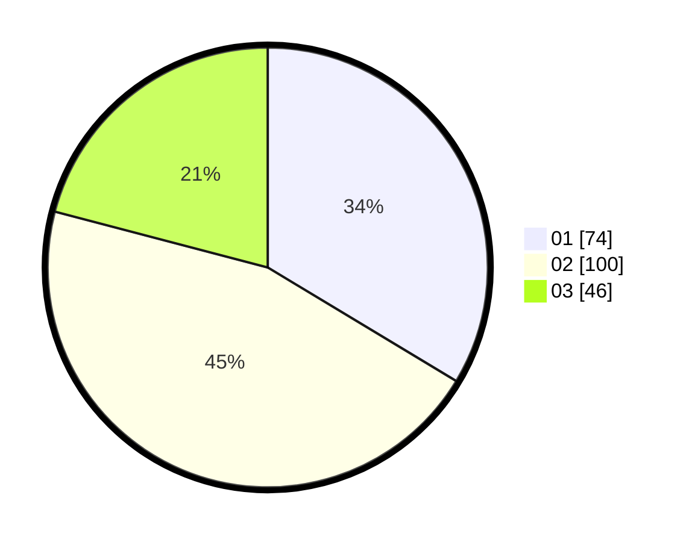

# Hasil

Hasil perolehan suara paslon dapat dilihat pada file paslon-01.txt, paslon-02.txt, dan paslon-03.txt.

Jika tidak ada, artinya data tersebut belum ada pada SIREKAP.

## Perolehan Suara

 * Paslon 01: **74**.
 * Paslon 02: **100**.
 * Paslon 03: **46**.

## Foto C Plano

https://sirekap-obj-formc.kpu.go.id/28a4/pemilu/ppwp/31/75/09/10/03/3175091003096-20240214-155527--93e653cf-5e51-4a16-b072-fb8f08d9e4eb.jpg

https://sirekap-obj-formc.kpu.go.id/28a4/pemilu/ppwp/31/75/09/10/03/3175091003096-20240214-155148--dda88e0d-118c-4bdf-af92-8ce61169bb1d.jpg

https://sirekap-obj-formc.kpu.go.id/28a4/pemilu/ppwp/31/75/09/10/03/3175091003096-20240214-155236--f6bba795-2a90-4b74-a842-6f490121ce99.jpg

## DATA PEMILIH TETAP

Jumlah pemilih dalam DPT: **245**.
 * L: **109**.
 * P: **136**.

## DATA PENGGUNA HAK PILIH

Jumlah pengguna hak pilih dalam DPT: **196**.
 * L: **80**.
 * P: **116**.

Jumlah pengguna hak pilih dalam DPTb: **6**.
 * L: **4**.
 * P: **2**.

Jumlah pengguna hak pilih dalam DPK: **20**.
 * L: **9**.
 * P: **11**.

Jumlah pengguna hak pilih: **222**.
 * L: **93**.
 * P: **129**.

## JUMLAH SUARA SAH DAN TIDAK SAH

JUMLAH SELURUH SUARA SAH: **220**.

JUMLAH SUARA TIDAK SAH: **2**.

JUMLAH SELURUH SUARA SAH DAN SUARA TIDAK SAH: **222**.
