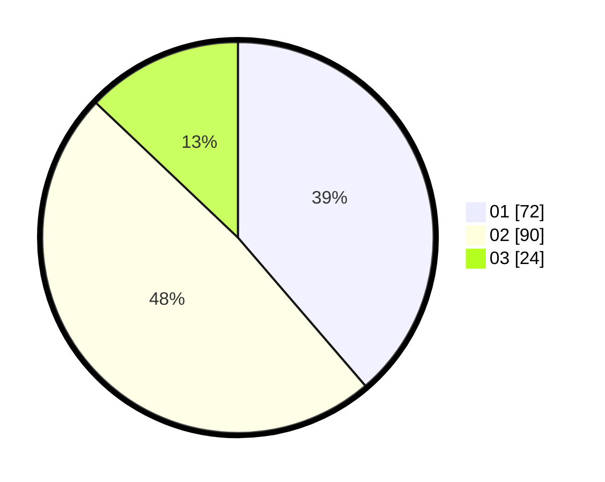

# Hasil

Hasil perolehan suara paslon dapat dilihat pada file paslon-01.txt, paslon-02.txt, dan paslon-03.txt.

Jika tidak ada, artinya data tersebut belum ada pada SIREKAP.

## Perolehan Suara

 * Paslon 01: **72**.
 * Paslon 02: **90**.
 * Paslon 03: **24**.

## Foto C Plano

https://sirekap-obj-formc.kpu.go.id/0bec/pemilu/ppwp/31/75/09/10/03/3175091003098-20240214-201404--94ad3696-e0f0-4bd7-852e-49ee8df3b821.jpg

https://sirekap-obj-formc.kpu.go.id/0bec/pemilu/ppwp/31/75/09/10/03/3175091003098-20240214-201551--4f314d8f-442c-4841-be53-6c16faa0b6da.jpg

https://sirekap-obj-formc.kpu.go.id/0bec/pemilu/ppwp/31/75/09/10/03/3175091003098-20240214-201710--d59bfc07-307d-45a2-b806-e3cbb7ee55d6.jpg

## DATA PEMILIH TETAP

Jumlah pemilih dalam DPT: **190**.
 * L: **80**.
 * P: **110**.

## DATA PENGGUNA HAK PILIH

Jumlah pengguna hak pilih dalam DPT: **253**.
 * L: **118**.
 * P: **135**.

Jumlah pengguna hak pilih dalam DPTb: **0**.
 * L: **0**.
 * P: **0**.

Jumlah pengguna hak pilih dalam DPK: **1**.
 * L: **1**.
 * P: **0**.

Jumlah pengguna hak pilih: **254**.
 * L: **119**.
 * P: **135**.

## JUMLAH SUARA SAH DAN TIDAK SAH

JUMLAH SELURUH SUARA SAH: **186**.

JUMLAH SUARA TIDAK SAH: **4**.

JUMLAH SELURUH SUARA SAH DAN SUARA TIDAK SAH: **190**.
