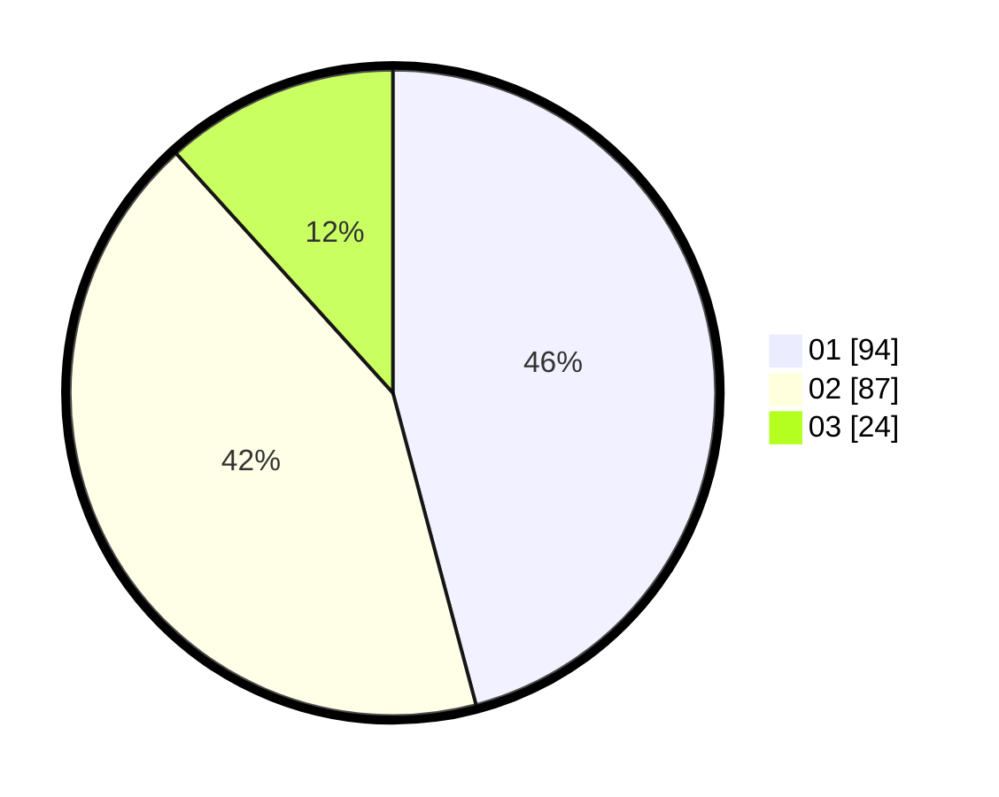

# Hasil

Hasil perolehan suara paslon dapat dilihat pada file paslon-01.txt, paslon-02.txt, dan paslon-03.txt.

Jika tidak ada, artinya data tersebut belum ada pada SIREKAP.

## Perolehan Suara

 * Paslon 01: **94**.
 * Paslon 02: **87**.
 * Paslon 03: **24**.

## Foto C Plano

https://sirekap-obj-formc.kpu.go.id/bb51/pemilu/ppwp/31/75/09/10/03/3175091003099-20240216-045230--b98c1412-e394-4d10-905c-112525a3206e.jpg

https://sirekap-obj-formc.kpu.go.id/bb51/pemilu/ppwp/31/75/09/10/03/3175091003099-20240214-192832--7312d7fe-cad2-415a-90c6-4d06f7637f38.jpg

https://sirekap-obj-formc.kpu.go.id/bb51/pemilu/ppwp/31/75/09/10/03/3175091003099-20240214-193309--79469427-2312-49fa-b131-74a7ba7249b5.jpg

## DATA PEMILIH TETAP

Jumlah pemilih dalam DPT: **251**.
 * L: **118**.
 * P: **133**.

## DATA PENGGUNA HAK PILIH

Jumlah pengguna hak pilih dalam DPT: **199**.
 * L: **90**.
 * P: **109**.

Jumlah pengguna hak pilih dalam DPTb: **1**.
 * L: **1**.
 * P: **0**.

Jumlah pengguna hak pilih dalam DPK: **8**.
 * L: **3**.
 * P: **5**.

Jumlah pengguna hak pilih: **208**.
 * L: **94**.
 * P: **114**.

## JUMLAH SUARA SAH DAN TIDAK SAH

JUMLAH SELURUH SUARA SAH: **205**.

JUMLAH SUARA TIDAK SAH: **3**.

JUMLAH SELURUH SUARA SAH DAN SUARA TIDAK SAH: **208**.
