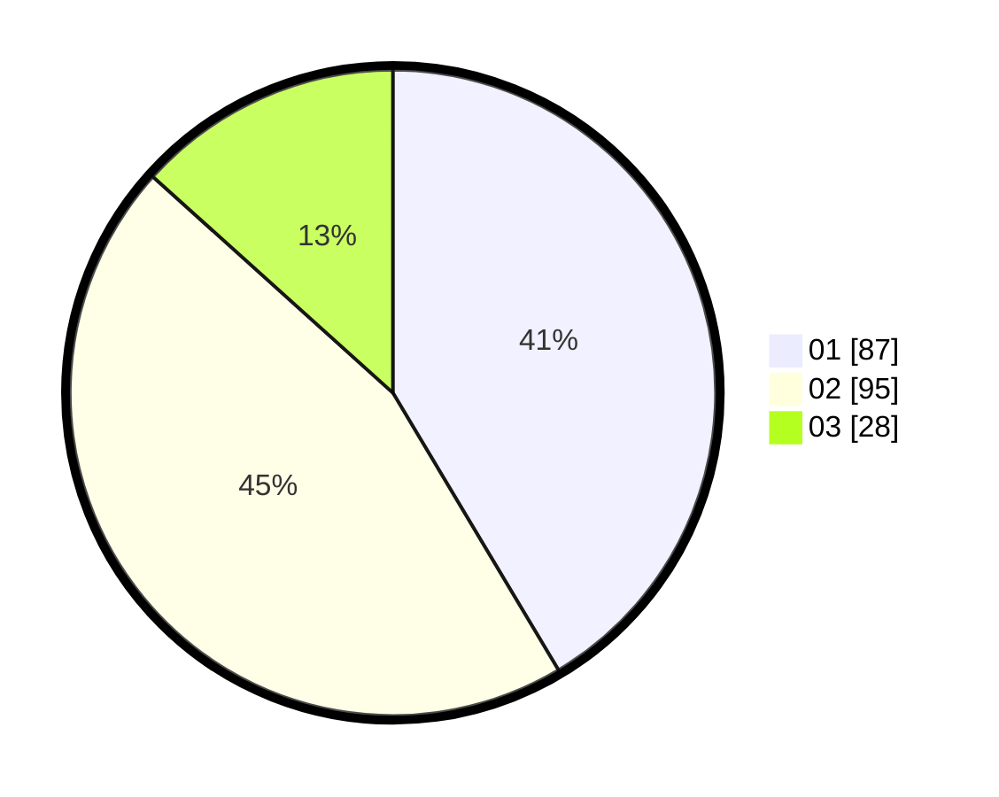

# Hasil

Hasil perolehan suara paslon dapat dilihat pada file paslon-01.txt, paslon-02.txt, dan paslon-03.txt.

Jika tidak ada, artinya data tersebut belum ada pada SIREKAP.

## Perolehan Suara

 * Paslon 01: **87**.
 * Paslon 02: **95**.
 * Paslon 03: **28**.

## Foto C Plano

https://sirekap-obj-formc.kpu.go.id/5871/pemilu/ppwp/31/75/09/10/03/3175091003105-20240214-190615--4eb31136-76f1-40e3-8308-45be408e790e.jpg

https://sirekap-obj-formc.kpu.go.id/5871/pemilu/ppwp/31/75/09/10/03/3175091003105-20240214-190624--37d313f1-a2fe-439d-84ac-147d1752510f.jpg

https://sirekap-obj-formc.kpu.go.id/5871/pemilu/ppwp/31/75/09/10/03/3175091003105-20240214-190647--49d8acea-50b0-49c4-9200-224a8c1863ae.jpg

## DATA PEMILIH TETAP

Jumlah pemilih dalam DPT: **266**.
 * L: **137**.
 * P: **129**.

## DATA PENGGUNA HAK PILIH

Jumlah pengguna hak pilih dalam DPT: **214**.
 * L: **104**.
 * P: **110**.

Jumlah pengguna hak pilih dalam DPTb: **0**.
 * L: **0**.
 * P: **0**.

Jumlah pengguna hak pilih dalam DPK: **0**.
 * L: **0**.
 * P: **0**.

Jumlah pengguna hak pilih: **214**.
 * L: **104**.
 * P: **110**.

## JUMLAH SUARA SAH DAN TIDAK SAH

JUMLAH SELURUH SUARA SAH: **210**.

JUMLAH SUARA TIDAK SAH: **4**.

JUMLAH SELURUH SUARA SAH DAN SUARA TIDAK SAH: **214**.
