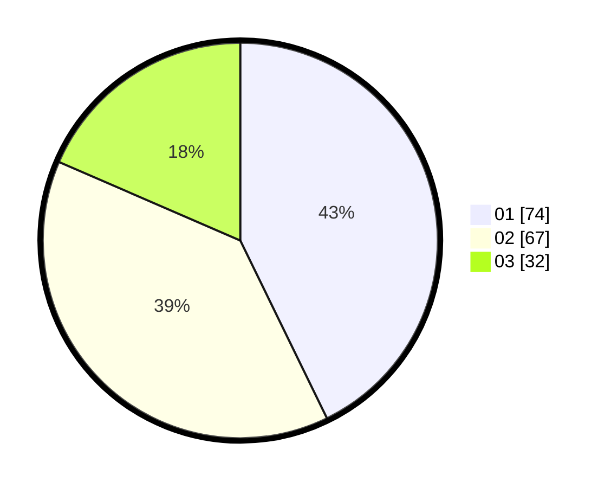

# Hasil

Hasil perolehan suara paslon dapat dilihat pada file paslon-01.txt, paslon-02.txt, dan paslon-03.txt.

Jika tidak ada, artinya data tersebut belum ada pada SIREKAP.

## Perolehan Suara

 * Paslon 01: **74**.
 * Paslon 02: **67**.
 * Paslon 03: **32**.

## Foto C Plano

https://sirekap-obj-formc.kpu.go.id/2ecb/pemilu/ppwp/31/75/09/10/03/3175091003108-20240215-202027--d187785f-267f-4fb6-9c65-af3316b930d7.jpg

https://sirekap-obj-formc.kpu.go.id/2ecb/pemilu/ppwp/31/75/09/10/03/3175091003108-20240215-202851--e898a0e9-afd5-4d38-922c-2be2f168f8e0.jpg

https://sirekap-obj-formc.kpu.go.id/2ecb/pemilu/ppwp/31/75/09/10/03/3175091003108-20240215-203004--3c883839-2576-4e8b-b440-3586eac257a3.jpg
