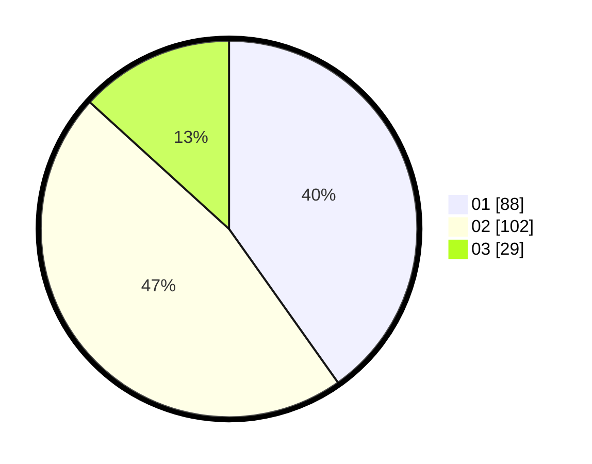

# Hasil

Hasil perolehan suara paslon dapat dilihat pada file paslon-01.txt, paslon-02.txt, dan paslon-03.txt.

Jika tidak ada, artinya data tersebut belum ada pada SIREKAP.

## Perolehan Suara

 * Paslon 01: **88**.
 * Paslon 02: **102**.
 * Paslon 03: **29**.

## Foto C Plano

https://sirekap-obj-formc.kpu.go.id/c09b/pemilu/ppwp/31/75/09/10/03/3175091003119-20240214-225136--a55231cd-c95b-420d-9b93-756af546dcca.jpg

https://sirekap-obj-formc.kpu.go.id/c09b/pemilu/ppwp/31/75/09/10/03/3175091003119-20240214-225132--24567599-a5e8-4212-a8d5-af4a45da6130.jpg
