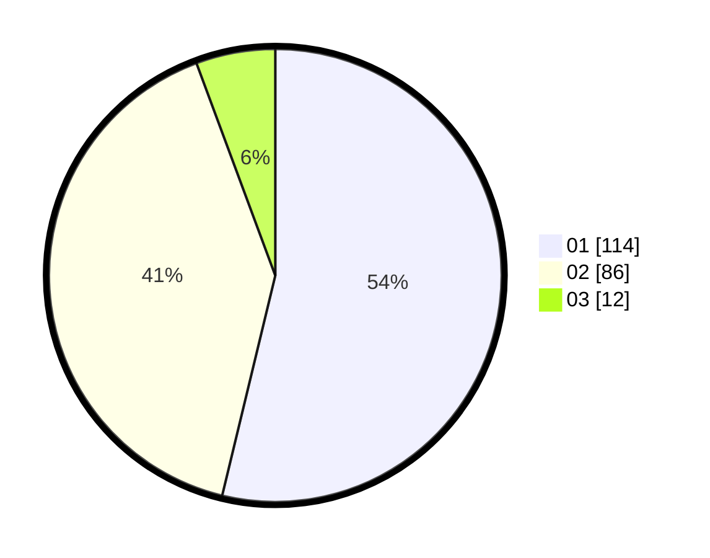

# Hasil

Hasil perolehan suara paslon dapat dilihat pada file paslon-01.txt, paslon-02.txt, dan paslon-03.txt.

Jika tidak ada, artinya data tersebut belum ada pada SIREKAP.

## Perolehan Suara

 * Paslon 01: **114**.
 * Paslon 02: **86**.
 * Paslon 03: **12**.

## Foto C Plano

https://sirekap-obj-formc.kpu.go.id/fb8b/pemilu/ppwp/31/75/09/10/03/3175091003124-20240214-223924--7fae55f5-23f8-4017-85db-723de1a43d80.jpg

https://sirekap-obj-formc.kpu.go.id/fb8b/pemilu/ppwp/31/75/09/10/03/3175091003124-20240214-223913--af366059-3dbf-4e14-9818-93f7127861d2.jpg

https://sirekap-obj-formc.kpu.go.id/fb8b/pemilu/ppwp/31/75/09/10/03/3175091003124-20240214-224030--5e43124b-d1b0-4974-8460-be48bb045e91.jpg
