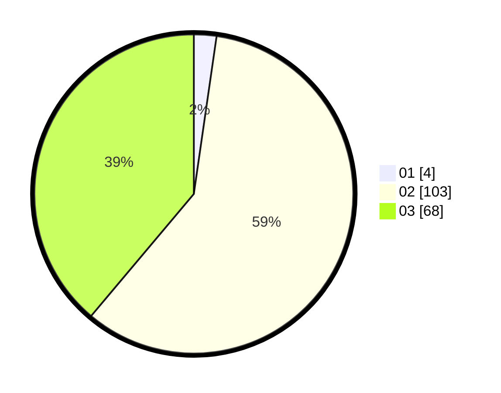

# Hasil

Hasil perolehan suara paslon dapat dilihat pada file paslon-01.txt, paslon-02.txt, dan paslon-03.txt.

Jika tidak ada, artinya data tersebut belum ada pada SIREKAP.

## Perolehan Suara

 * Paslon 01: **4**.
 * Paslon 02: **103**.
 * Paslon 03: **68**.

## Foto C Plano

https://sirekap-obj-formc.kpu.go.id/f411/pemilu/ppwp/31/75/09/10/03/3175091003128-20240214-233441--3edcc5ab-65c4-4993-aa1f-a35bd7cf8f62.jpg

https://sirekap-obj-formc.kpu.go.id/f411/pemilu/ppwp/31/75/09/10/03/3175091003128-20240214-233608--6163e8d4-68c3-48a4-ba69-e59885ef177d.jpg
