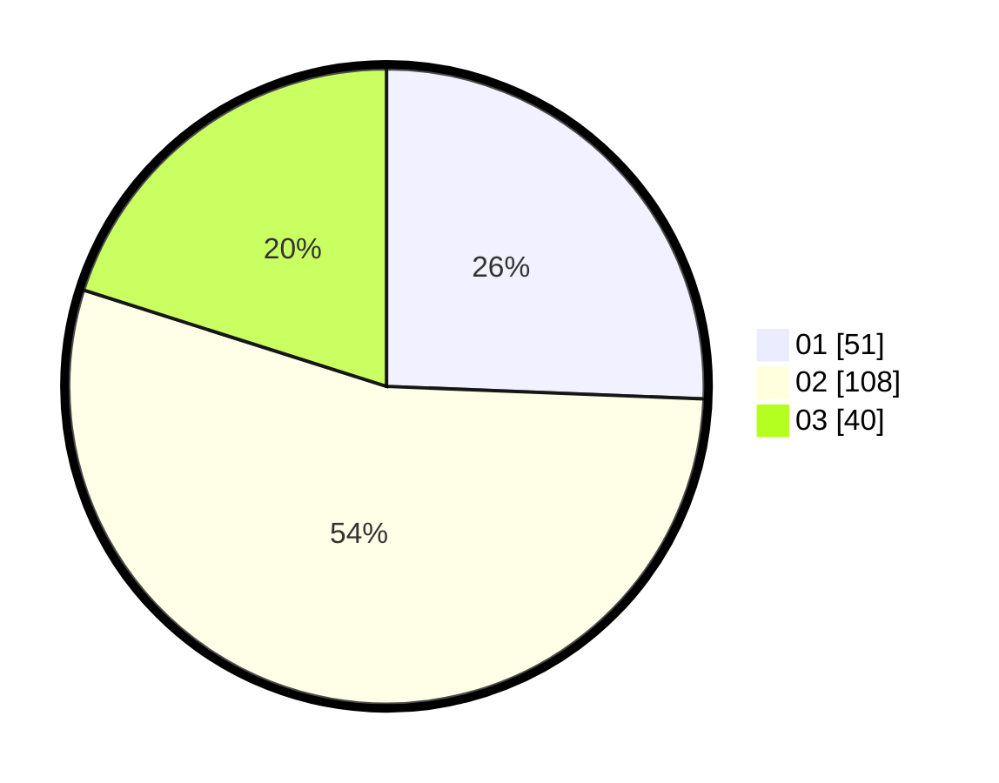

# Hasil

Hasil perolehan suara paslon dapat dilihat pada file paslon-01.txt, paslon-02.txt, dan paslon-03.txt.

Jika tidak ada, artinya data tersebut belum ada pada SIREKAP.

## Perolehan Suara

 * Paslon 01: **51**.
 * Paslon 02: **108**.
 * Paslon 03: **40**.

## Foto C Plano

https://sirekap-obj-formc.kpu.go.id/9aa2/pemilu/ppwp/31/75/09/10/03/3175091003130-20240214-184521--0a7e2f6d-45c4-4ab4-b046-972574b6cbc7.jpg

https://sirekap-obj-formc.kpu.go.id/9aa2/pemilu/ppwp/31/75/09/10/03/3175091003130-20240214-184512--c3340348-43fa-4596-8d48-e99ba20f87e5.jpg

https://sirekap-obj-formc.kpu.go.id/9aa2/pemilu/ppwp/31/75/09/10/03/3175091003130-20240214-184455--b420f43d-2f02-4aa4-b64f-5ce45072af65.jpg

## DATA PEMILIH TETAP

Jumlah pemilih dalam DPT: **256**.
 * L: **130**.
 * P: **126**.

## DATA PENGGUNA HAK PILIH

Jumlah pengguna hak pilih dalam DPT: **202**.
 * L: **92**.
 * P: **110**.

Jumlah pengguna hak pilih dalam DPTb: **0**.
 * L: **0**.
 * P: **0**.

Jumlah pengguna hak pilih dalam DPK: **0**.
 * L: **0**.
 * P: **0**.

Jumlah pengguna hak pilih: **202**.
 * L: **92**.
 * P: **110**.

## JUMLAH SUARA SAH DAN TIDAK SAH

JUMLAH SELURUH SUARA SAH: **199**.

JUMLAH SUARA TIDAK SAH: **3**.

JUMLAH SELURUH SUARA SAH DAN SUARA TIDAK SAH: **202**.
