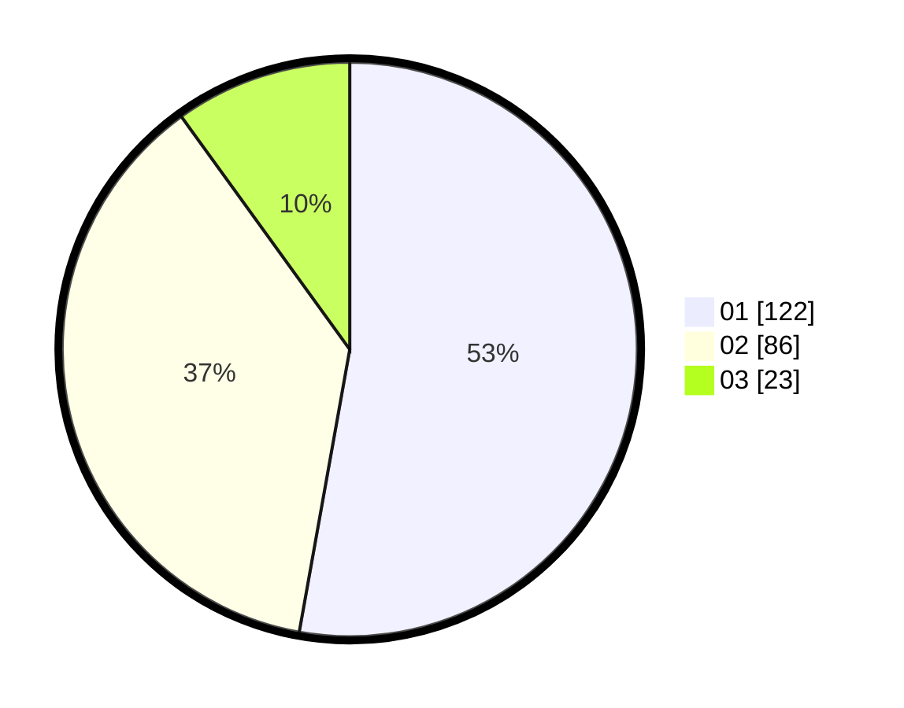

# Hasil

Hasil perolehan suara paslon dapat dilihat pada file paslon-01.txt, paslon-02.txt, dan paslon-03.txt.

Jika tidak ada, artinya data tersebut belum ada pada SIREKAP.

## Perolehan Suara

 * Paslon 01: **122**.
 * Paslon 02: **86**.
 * Paslon 03: **23**.

## Foto C Plano

https://sirekap-obj-formc.kpu.go.id/ce91/pemilu/ppwp/31/75/09/10/03/3175091003137-20240214-192730--e78567ff-7e62-44af-ab17-4e8cc13a9e9b.jpg

https://sirekap-obj-formc.kpu.go.id/ce91/pemilu/ppwp/31/75/09/10/03/3175091003137-20240214-192642--377fc950-2775-4b85-8827-45f393b8cf9b.jpg

https://sirekap-obj-formc.kpu.go.id/ce91/pemilu/ppwp/31/75/09/10/03/3175091003137-20240214-192713--3493ad1c-57fd-4f1c-bef4-101bfd51260f.jpg

## DATA PEMILIH TETAP

Jumlah pemilih dalam DPT: **272**.
 * L: **132**.
 * P: **140**.

## DATA PENGGUNA HAK PILIH

Jumlah pengguna hak pilih dalam DPT: **223**.
 * L: **107**.
 * P: **116**.

Jumlah pengguna hak pilih dalam DPTb: **4**.
 * L: **2**.
 * P: **2**.

Jumlah pengguna hak pilih dalam DPK: **5**.
 * L: **2**.
 * P: **3**.

Jumlah pengguna hak pilih: **232**.
 * L: **111**.
 * P: **121**.

## JUMLAH SUARA SAH DAN TIDAK SAH

JUMLAH SELURUH SUARA SAH: **231**.

JUMLAH SUARA TIDAK SAH: **2**.

JUMLAH SELURUH SUARA SAH DAN SUARA TIDAK SAH: **233**.
