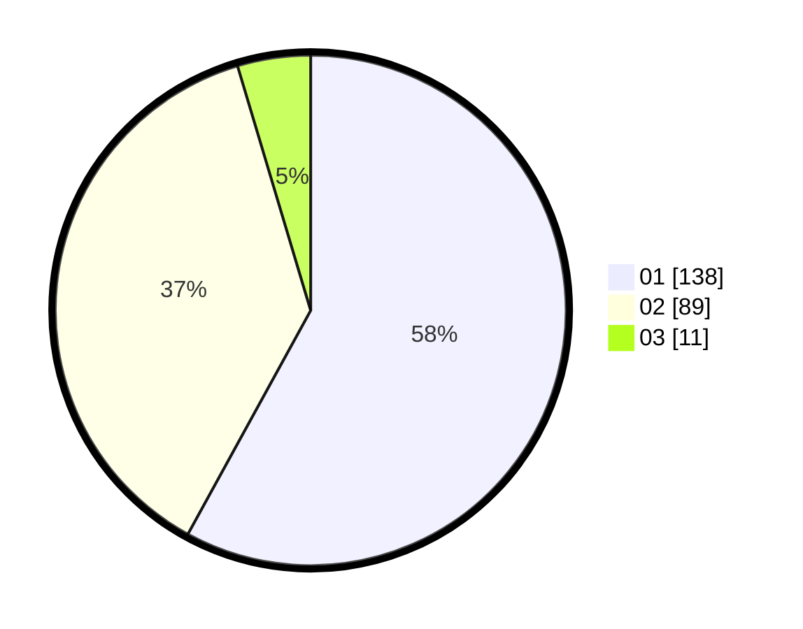

# Hasil

Hasil perolehan suara paslon dapat dilihat pada file paslon-01.txt, paslon-02.txt, dan paslon-03.txt.

Jika tidak ada, artinya data tersebut belum ada pada SIREKAP.

## Perolehan Suara

 * Paslon 01: **138**.
 * Paslon 02: **89**.
 * Paslon 03: **11**.

## Foto C Plano

https://sirekap-obj-formc.kpu.go.id/5435/pemilu/ppwp/31/75/09/10/03/3175091003138-20240214-185521--d2bb92bb-7618-4e83-ab5f-e72ba048ee48.jpg

https://sirekap-obj-formc.kpu.go.id/5435/pemilu/ppwp/31/75/09/10/03/3175091003138-20240214-185524--85703e8b-c568-4362-8c9f-63c5f892a8f9.jpg

https://sirekap-obj-formc.kpu.go.id/5435/pemilu/ppwp/31/75/09/10/03/3175091003138-20240214-185529--1d7433cd-4d02-43f4-98e7-c3d62d5eda81.jpg

## DATA PEMILIH TETAP

Jumlah pemilih dalam DPT: **259**.
 * L: **124**.
 * P: **135**.

## DATA PENGGUNA HAK PILIH

Jumlah pengguna hak pilih dalam DPT: **235**.
 * L: **109**.
 * P: **126**.

Jumlah pengguna hak pilih dalam DPTb: **2**.
 * L: **2**.
 * P: **0**.

Jumlah pengguna hak pilih dalam DPK: **2**.
 * L: **1**.
 * P: **1**.

Jumlah pengguna hak pilih: **239**.
 * L: **112**.
 * P: **127**.

## JUMLAH SUARA SAH DAN TIDAK SAH

JUMLAH SELURUH SUARA SAH: **238**.

JUMLAH SUARA TIDAK SAH: **1**.

JUMLAH SELURUH SUARA SAH DAN SUARA TIDAK SAH: **239**.
