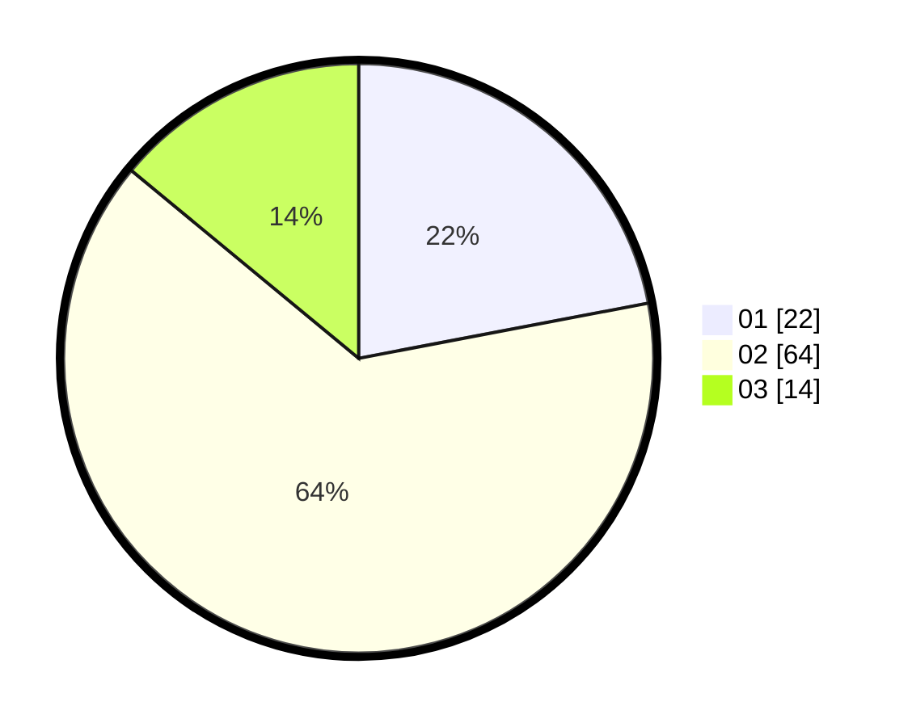

# Hasil

Hasil perolehan suara paslon dapat dilihat pada file paslon-01.txt, paslon-02.txt, dan paslon-03.txt.

Jika tidak ada, artinya data tersebut belum ada pada SIREKAP.

## Perolehan Suara

 * Paslon 01: **22**.
 * Paslon 02: **64**.
 * Paslon 03: **14**.

## Foto C Plano

https://sirekap-obj-formc.kpu.go.id/4a4d/pemilu/ppwp/31/75/09/10/03/3175091003142-20240214-192012--26be30f1-6844-46d6-a520-168f90ea7dda.jpg

https://sirekap-obj-formc.kpu.go.id/4a4d/pemilu/ppwp/31/75/09/10/03/3175091003142-20240214-192137--6ad8433a-2648-4fa9-a255-84403507a8a7.jpg

https://sirekap-obj-formc.kpu.go.id/4a4d/pemilu/ppwp/31/75/09/10/03/3175091003142-20240214-192247--261a5162-4815-485b-a6d3-5cfb560d41d9.jpg

## DATA PEMILIH TETAP

Jumlah pemilih dalam DPT: **206**.
 * L: **105**.
 * P: **101**.

## DATA PENGGUNA HAK PILIH

Jumlah pengguna hak pilih dalam DPT: **100**.
 * L: **48**.
 * P: **52**.

Jumlah pengguna hak pilih dalam DPTb: **3**.
 * L: **2**.
 * P: **1**.

Jumlah pengguna hak pilih dalam DPK: **0**.
 * L: **0**.
 * P: **0**.

Jumlah pengguna hak pilih: **103**.
 * L: **50**.
 * P: **53**.

## JUMLAH SUARA SAH DAN TIDAK SAH

JUMLAH SELURUH SUARA SAH: **100**.

JUMLAH SUARA TIDAK SAH: **3**.

JUMLAH SELURUH SUARA SAH DAN SUARA TIDAK SAH: **103**.
