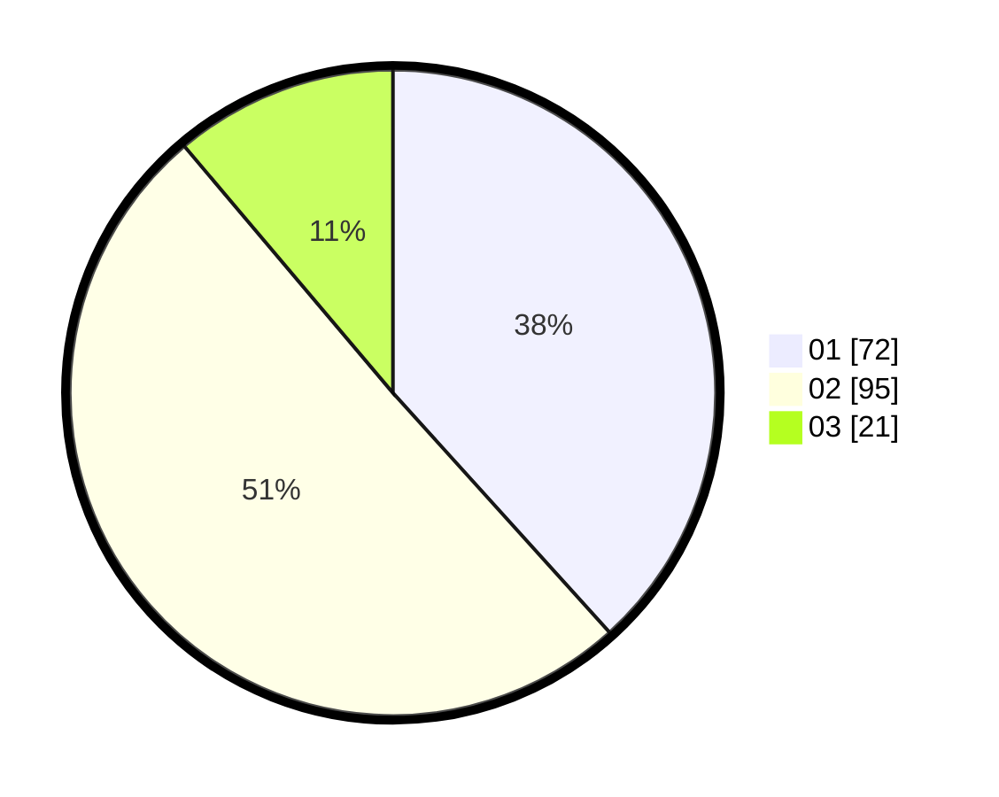

# Hasil

Hasil perolehan suara paslon dapat dilihat pada file paslon-01.txt, paslon-02.txt, dan paslon-03.txt.

Jika tidak ada, artinya data tersebut belum ada pada SIREKAP.

## Perolehan Suara

 * Paslon 01: **72**.
 * Paslon 02: **95**.
 * Paslon 03: **21**.

## Foto C Plano

https://sirekap-obj-formc.kpu.go.id/175a/pemilu/ppwp/31/75/09/10/03/3175091003151-20240214-222952--0b1433e2-ef24-4bbb-aec9-4f2f3bcf7f59.jpg

https://sirekap-obj-formc.kpu.go.id/175a/pemilu/ppwp/31/75/09/10/03/3175091003151-20240214-223009--5e7217c2-25b1-43c2-a648-55f10ae16ef2.jpg
