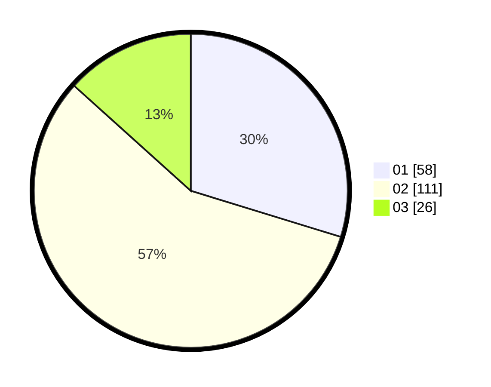

# Hasil

Hasil perolehan suara paslon dapat dilihat pada file paslon-01.txt, paslon-02.txt, dan paslon-03.txt.

Jika tidak ada, artinya data tersebut belum ada pada SIREKAP.

## Perolehan Suara

 * Paslon 01: **58**.
 * Paslon 02: **111**.
 * Paslon 03: **26**.

## Foto C Plano

https://sirekap-obj-formc.kpu.go.id/05f9/pemilu/ppwp/31/75/09/10/03/3175091003153-20240214-200613--674bdb89-e9b7-47a3-a5a3-dd99bf7f8065.jpg

https://sirekap-obj-formc.kpu.go.id/05f9/pemilu/ppwp/31/75/09/10/03/3175091003153-20240214-200919--5ad4fdec-ba6f-47e4-973a-bfdfb01b4097.jpg

https://sirekap-obj-formc.kpu.go.id/05f9/pemilu/ppwp/31/75/09/10/03/3175091003153-20240214-201440--7c351447-3384-43db-b2e1-879541747fc7.jpg
