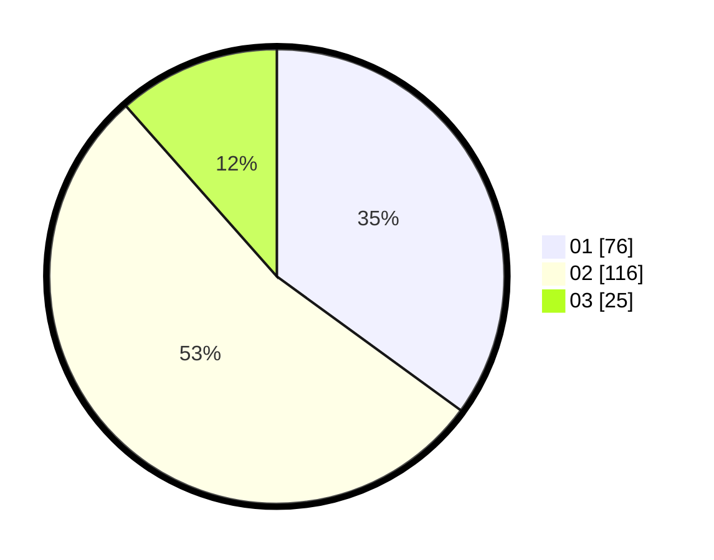

# Hasil

Hasil perolehan suara paslon dapat dilihat pada file paslon-01.txt, paslon-02.txt, dan paslon-03.txt.

Jika tidak ada, artinya data tersebut belum ada pada SIREKAP.

## Perolehan Suara

 * Paslon 01: **76**.
 * Paslon 02: **116**.
 * Paslon 03: **25**.

## Foto C Plano

https://sirekap-obj-formc.kpu.go.id/7da5/pemilu/ppwp/31/75/09/10/03/3175091003158-20240214-191359--d7768547-d1d7-4866-98ae-27ac87d2876d.jpg

https://sirekap-obj-formc.kpu.go.id/7da5/pemilu/ppwp/31/75/09/10/03/3175091003158-20240214-191454--07f87526-de4d-465d-a852-8c4583fd0679.jpg

https://sirekap-obj-formc.kpu.go.id/7da5/pemilu/ppwp/31/75/09/10/03/3175091003158-20240214-191551--25737641-4bd3-4d6a-bf00-97de1d28b51b.jpg

## DATA PEMILIH TETAP

Jumlah pemilih dalam DPT: **266**.
 * L: **132**.
 * P: **134**.

## DATA PENGGUNA HAK PILIH

Jumlah pengguna hak pilih dalam DPT: **214**.
 * L: **101**.
 * P: **113**.

Jumlah pengguna hak pilih dalam DPTb: **0**.
 * L: **0**.
 * P: **0**.

Jumlah pengguna hak pilih dalam DPK: **4**.
 * L: **3**.
 * P: **1**.

Jumlah pengguna hak pilih: **218**.
 * L: **104**.
 * P: **114**.

## JUMLAH SUARA SAH DAN TIDAK SAH

JUMLAH SELURUH SUARA SAH: **217**.

JUMLAH SUARA TIDAK SAH: **1**.

JUMLAH SELURUH SUARA SAH DAN SUARA TIDAK SAH: **218**.
