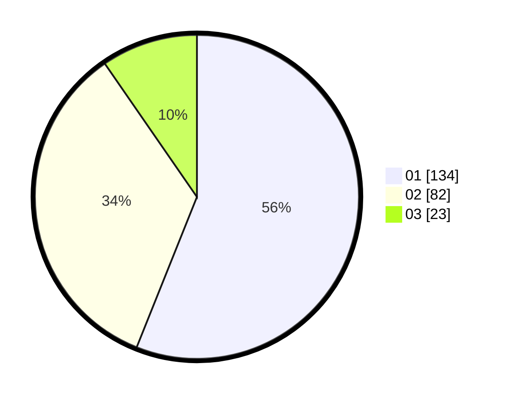

# Hasil

Hasil perolehan suara paslon dapat dilihat pada file paslon-01.txt, paslon-02.txt, dan paslon-03.txt.

Jika tidak ada, artinya data tersebut belum ada pada SIREKAP.

## Perolehan Suara

 * Paslon 01: **134**.
 * Paslon 02: **82**.
 * Paslon 03: **23**.

## Foto C Plano

https://sirekap-obj-formc.kpu.go.id/cfd5/pemilu/ppwp/31/75/09/10/04/3175091004002-20240216-141738--990bc4f2-732a-45a3-bd93-ce2824e8f722.jpg

https://sirekap-obj-formc.kpu.go.id/cfd5/pemilu/ppwp/31/75/09/10/04/3175091004002-20240216-141739--e62cfe3a-7d1f-4c0c-9664-7057d5a5968b.jpg

https://sirekap-obj-formc.kpu.go.id/cfd5/pemilu/ppwp/31/75/09/10/04/3175091004002-20240216-141739--d0322328-2094-4edb-ac01-ed73025822ac.jpg

## DATA PEMILIH TETAP

Jumlah pemilih dalam DPT: **278**.
 * L: **142**.
 * P: **136**.

## DATA PENGGUNA HAK PILIH

Jumlah pengguna hak pilih dalam DPT: **238**.
 * L: **116**.
 * P: **122**.

Jumlah pengguna hak pilih dalam DPTb: **2**.
 * L: **1**.
 * P: **1**.

Jumlah pengguna hak pilih dalam DPK: **1**.
 * L: **1**.
 * P: **0**.

Jumlah pengguna hak pilih: **241**.
 * L: **118**.
 * P: **123**.

## JUMLAH SUARA SAH DAN TIDAK SAH

JUMLAH SELURUH SUARA SAH: **239**.

JUMLAH SUARA TIDAK SAH: **2**.

JUMLAH SELURUH SUARA SAH DAN SUARA TIDAK SAH: **241**.
