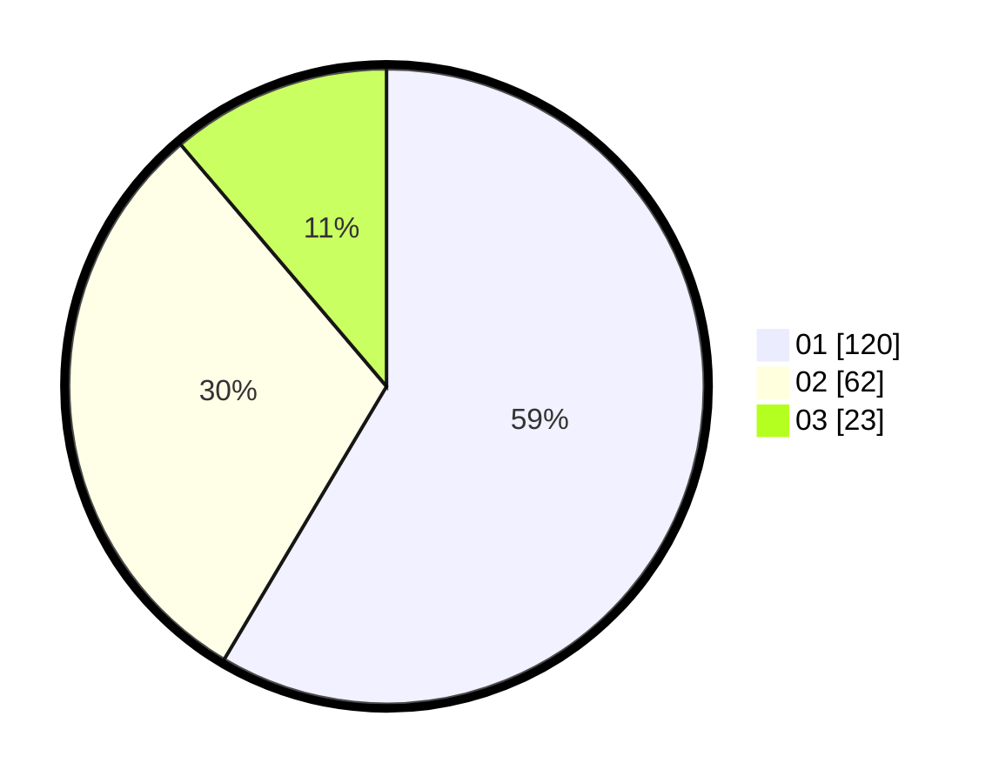

# Hasil

Hasil perolehan suara paslon dapat dilihat pada file paslon-01.txt, paslon-02.txt, dan paslon-03.txt.

Jika tidak ada, artinya data tersebut belum ada pada SIREKAP.

## Perolehan Suara

 * Paslon 01: **120**.
 * Paslon 02: **62**.
 * Paslon 03: **23**.

## Foto C Plano

https://sirekap-obj-formc.kpu.go.id/4f5c/pemilu/ppwp/31/75/09/10/04/3175091004015-20240215-222833--2491b541-48ab-416a-847e-45e24f4b6fbb.jpg

https://sirekap-obj-formc.kpu.go.id/4f5c/pemilu/ppwp/31/75/09/10/04/3175091004015-20240215-222835--726bec0d-02de-4e70-87cd-7112c57232b9.jpg

https://sirekap-obj-formc.kpu.go.id/4f5c/pemilu/ppwp/31/75/09/10/04/3175091004015-20240215-222834--7889443e-ab15-42fe-b437-d476ad98c555.jpg

## DATA PEMILIH TETAP

Jumlah pemilih dalam DPT: **264**.
 * L: **127**.
 * P: **137**.

## DATA PENGGUNA HAK PILIH

Jumlah pengguna hak pilih dalam DPT: **203**.
 * L: **98**.
 * P: **105**.

Jumlah pengguna hak pilih dalam DPTb: **1**.
 * L: **1**.
 * P: **0**.

Jumlah pengguna hak pilih dalam DPK: **2**.
 * L: **1**.
 * P: **1**.

Jumlah pengguna hak pilih: **206**.
 * L: **100**.
 * P: **106**.

## JUMLAH SUARA SAH DAN TIDAK SAH

JUMLAH SELURUH SUARA SAH: **205**.

JUMLAH SUARA TIDAK SAH: **1**.

JUMLAH SELURUH SUARA SAH DAN SUARA TIDAK SAH: **206**.
