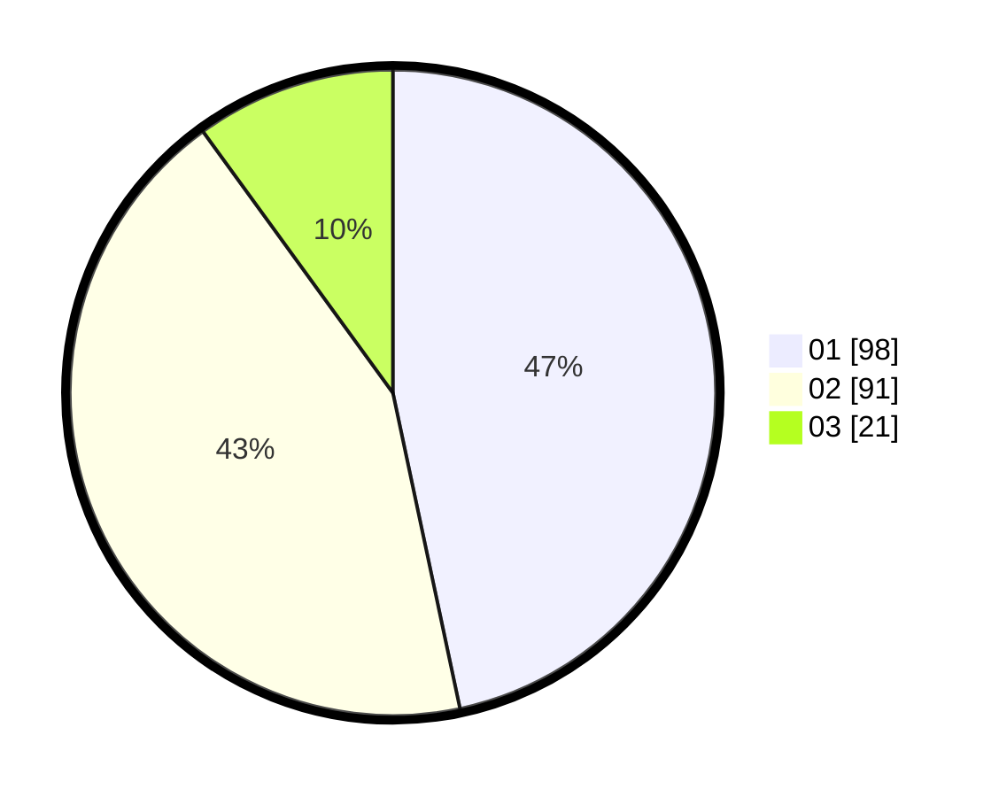

# Hasil

Hasil perolehan suara paslon dapat dilihat pada file paslon-01.txt, paslon-02.txt, dan paslon-03.txt.

Jika tidak ada, artinya data tersebut belum ada pada SIREKAP.

## Perolehan Suara

 * Paslon 01: **98**.
 * Paslon 02: **91**.
 * Paslon 03: **21**.

## Foto C Plano

https://sirekap-obj-formc.kpu.go.id/5ac1/pemilu/ppwp/31/75/09/10/04/3175091004016-20240216-045030--5529ee44-844f-4539-ad9d-3b47a0dce1b0.jpg

https://sirekap-obj-formc.kpu.go.id/5ac1/pemilu/ppwp/31/75/09/10/04/3175091004016-20240216-045043--d20b8d80-dc0e-43a2-9191-7a90ad8b02c2.jpg

https://sirekap-obj-formc.kpu.go.id/5ac1/pemilu/ppwp/31/75/09/10/04/3175091004016-20240216-045033--874b2b75-0cf5-43d2-9cad-541c91e5f990.jpg

## DATA PEMILIH TETAP

Jumlah pemilih dalam DPT: **277**.
 * L: **148**.
 * P: **129**.

## DATA PENGGUNA HAK PILIH

Jumlah pengguna hak pilih dalam DPT: **201**.
 * L: **100**.
 * P: **101**.

Jumlah pengguna hak pilih dalam DPTb: **2**.
 * L: **2**.
 * P: **0**.

Jumlah pengguna hak pilih dalam DPK: **8**.
 * L: **4**.
 * P: **4**.

Jumlah pengguna hak pilih: **211**.
 * L: **106**.
 * P: **105**.

## JUMLAH SUARA SAH DAN TIDAK SAH

JUMLAH SELURUH SUARA SAH: **210**.

JUMLAH SUARA TIDAK SAH: **1**.

JUMLAH SELURUH SUARA SAH DAN SUARA TIDAK SAH: **211**.
