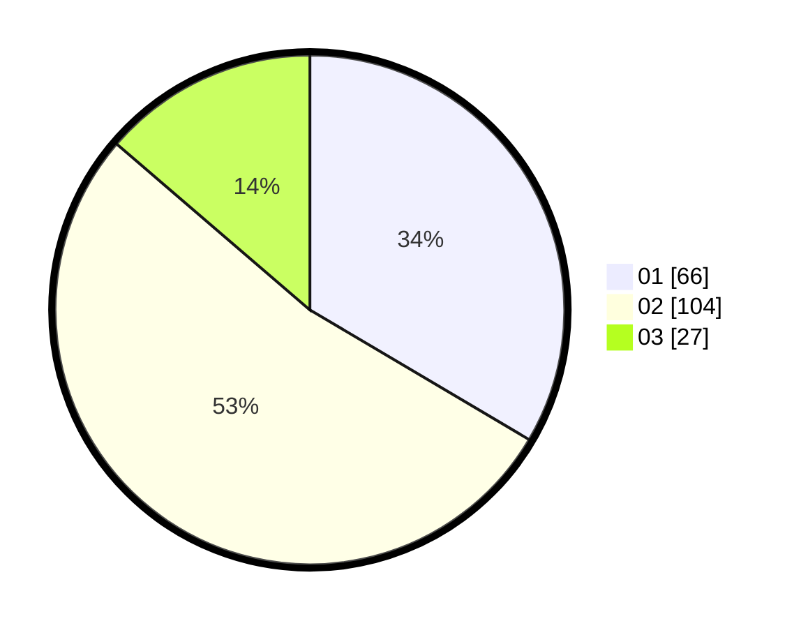

# Hasil

Hasil perolehan suara paslon dapat dilihat pada file paslon-01.txt, paslon-02.txt, dan paslon-03.txt.

Jika tidak ada, artinya data tersebut belum ada pada SIREKAP.

## Perolehan Suara

 * Paslon 01: **66**.
 * Paslon 02: **104**.
 * Paslon 03: **27**.

## Foto C Plano

https://sirekap-obj-formc.kpu.go.id/2edf/pemilu/ppwp/31/75/09/10/04/3175091004021-20240214-190855--a8dc60d0-c468-47c1-8497-e11c8ab0d43e.jpg

https://sirekap-obj-formc.kpu.go.id/2edf/pemilu/ppwp/31/75/09/10/04/3175091004021-20240214-191009--721e2c69-2b21-4938-9482-339b849a3358.jpg

https://sirekap-obj-formc.kpu.go.id/2edf/pemilu/ppwp/31/75/09/10/04/3175091004021-20240214-191124--b4c7f59d-1e81-4770-a80c-326bf1fba834.jpg

## DATA PEMILIH TETAP

Jumlah pemilih dalam DPT: **274**.
 * L: **138**.
 * P: **136**.

## DATA PENGGUNA HAK PILIH

Jumlah pengguna hak pilih dalam DPT: **193**.
 * L: **94**.
 * P: **99**.

Jumlah pengguna hak pilih dalam DPTb: **7**.
 * L: **3**.
 * P: **4**.

Jumlah pengguna hak pilih dalam DPK: **0**.
 * L: **0**.
 * P: **0**.

Jumlah pengguna hak pilih: **200**.
 * L: **97**.
 * P: **103**.

## JUMLAH SUARA SAH DAN TIDAK SAH

JUMLAH SELURUH SUARA SAH: **197**.

JUMLAH SUARA TIDAK SAH: **3**.

JUMLAH SELURUH SUARA SAH DAN SUARA TIDAK SAH: **200**.
