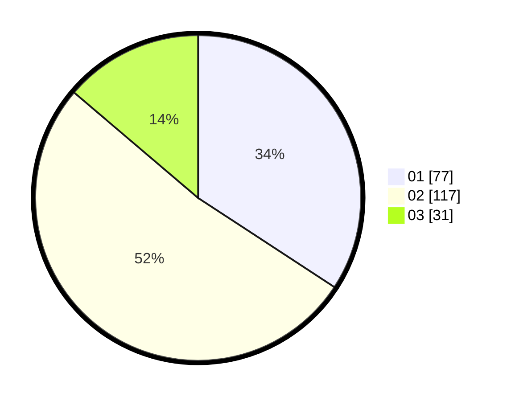

# Hasil

Hasil perolehan suara paslon dapat dilihat pada file paslon-01.txt, paslon-02.txt, dan paslon-03.txt.

Jika tidak ada, artinya data tersebut belum ada pada SIREKAP.

## Perolehan Suara

 * Paslon 01: **77**.
 * Paslon 02: **117**.
 * Paslon 03: **31**.

## Foto C Plano

https://sirekap-obj-formc.kpu.go.id/b2a8/pemilu/ppwp/31/75/09/10/04/3175091004022-20240216-141611--234c03c3-dec8-4dec-ba63-94b090e3ce01.jpg

https://sirekap-obj-formc.kpu.go.id/b2a8/pemilu/ppwp/31/75/09/10/04/3175091004022-20240216-141612--3f9b49d8-5d80-4cac-b278-0853eb2a0139.jpg

https://sirekap-obj-formc.kpu.go.id/b2a8/pemilu/ppwp/31/75/09/10/04/3175091004022-20240216-141611--0887cd90-bc56-4030-9bf5-183c25101e82.jpg

## DATA PEMILIH TETAP

Jumlah pemilih dalam DPT: **277**.
 * L: **142**.
 * P: **135**.

## DATA PENGGUNA HAK PILIH

Jumlah pengguna hak pilih dalam DPT: **223**.
 * L: **115**.
 * P: **108**.

Jumlah pengguna hak pilih dalam DPTb: **2**.
 * L: **1**.
 * P: **1**.

Jumlah pengguna hak pilih dalam DPK: **1**.
 * L: **1**.
 * P: **0**.

Jumlah pengguna hak pilih: **226**.
 * L: **117**.
 * P: **109**.

## JUMLAH SUARA SAH DAN TIDAK SAH

JUMLAH SELURUH SUARA SAH: **225**.

JUMLAH SUARA TIDAK SAH: **1**.

JUMLAH SELURUH SUARA SAH DAN SUARA TIDAK SAH: **226**.
