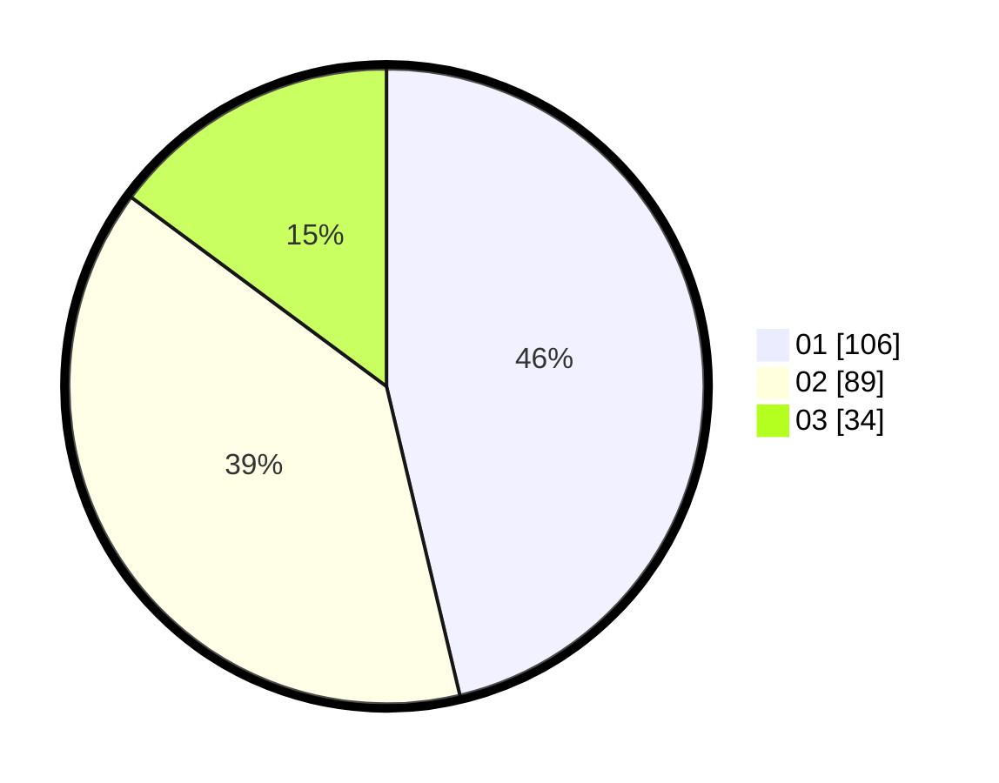

# Hasil

Hasil perolehan suara paslon dapat dilihat pada file paslon-01.txt, paslon-02.txt, dan paslon-03.txt.

Jika tidak ada, artinya data tersebut belum ada pada SIREKAP.

## Perolehan Suara

 * Paslon 01: **106**.
 * Paslon 02: **89**.
 * Paslon 03: **34**.

## Foto C Plano

https://sirekap-obj-formc.kpu.go.id/5382/pemilu/ppwp/31/75/09/10/04/3175091004031-20240214-185517--7bb138a2-6a29-4f7d-9d5c-2539ad5ef506.jpg

https://sirekap-obj-formc.kpu.go.id/5382/pemilu/ppwp/31/75/09/10/04/3175091004031-20240214-185525--4652fcf8-2ca7-4604-af72-7099fa23e2ed.jpg

https://sirekap-obj-formc.kpu.go.id/5382/pemilu/ppwp/31/75/09/10/04/3175091004031-20240214-185530--91d18501-df84-4fa1-a480-2aadb98d2d05.jpg

## DATA PEMILIH TETAP

Jumlah pemilih dalam DPT: **259**.
 * L: **129**.
 * P: **130**.

## DATA PENGGUNA HAK PILIH

Jumlah pengguna hak pilih dalam DPT: **226**.
 * L: **108**.
 * P: **118**.

Jumlah pengguna hak pilih dalam DPTb: **1**.
 * L: **1**.
 * P: **0**.

Jumlah pengguna hak pilih dalam DPK: **4**.
 * L: **2**.
 * P: **2**.

Jumlah pengguna hak pilih: **231**.
 * L: **111**.
 * P: **120**.

## JUMLAH SUARA SAH DAN TIDAK SAH

JUMLAH SELURUH SUARA SAH: **229**.

JUMLAH SUARA TIDAK SAH: **2**.

JUMLAH SELURUH SUARA SAH DAN SUARA TIDAK SAH: **231**.
