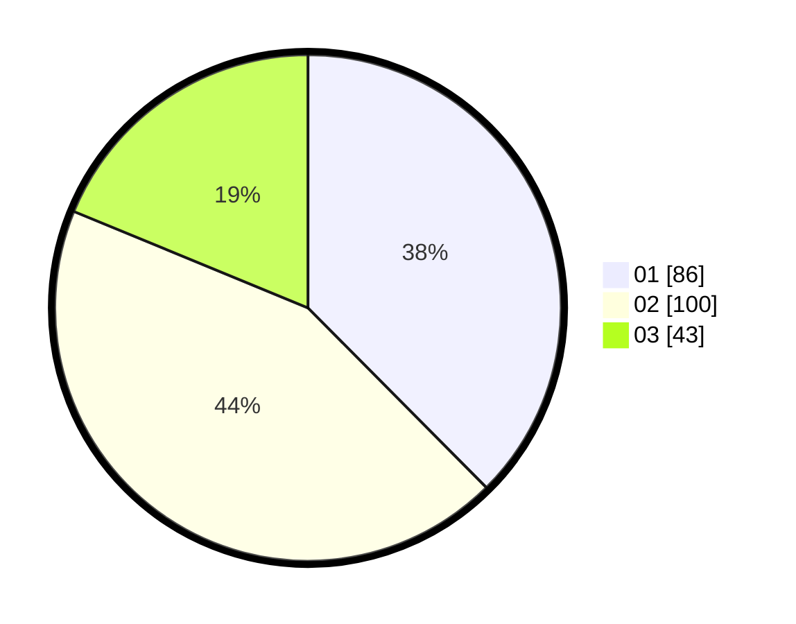

# Hasil

Hasil perolehan suara paslon dapat dilihat pada file paslon-01.txt, paslon-02.txt, dan paslon-03.txt.

Jika tidak ada, artinya data tersebut belum ada pada SIREKAP.

## Perolehan Suara

 * Paslon 01: **86**.
 * Paslon 02: **100**.
 * Paslon 03: **43**.

## Foto C Plano

https://sirekap-obj-formc.kpu.go.id/8205/pemilu/ppwp/31/75/09/10/04/3175091004033-20240216-025324--245c54ec-4542-4415-879e-f49738bea2c7.jpg

https://sirekap-obj-formc.kpu.go.id/8205/pemilu/ppwp/31/75/09/10/04/3175091004033-20240216-045055--6ca8068f-72cd-45b5-a1e4-f364685d93bf.jpg

https://sirekap-obj-formc.kpu.go.id/8205/pemilu/ppwp/31/75/09/10/04/3175091004033-20240216-025330--80d8801c-1e8c-4383-847a-086e71aff842.jpg

## DATA PEMILIH TETAP

Jumlah pemilih dalam DPT: **267**.
 * L: **116**.
 * P: **151**.

## DATA PENGGUNA HAK PILIH

Jumlah pengguna hak pilih dalam DPT: **223**.
 * L: **98**.
 * P: **125**.

Jumlah pengguna hak pilih dalam DPTb: **3**.
 * L: **2**.
 * P: **1**.

Jumlah pengguna hak pilih dalam DPK: **7**.
 * L: **3**.
 * P: **4**.

Jumlah pengguna hak pilih: **233**.
 * L: **103**.
 * P: **130**.

## JUMLAH SUARA SAH DAN TIDAK SAH

JUMLAH SELURUH SUARA SAH: **229**.

JUMLAH SUARA TIDAK SAH: **4**.

JUMLAH SELURUH SUARA SAH DAN SUARA TIDAK SAH: **233**.
