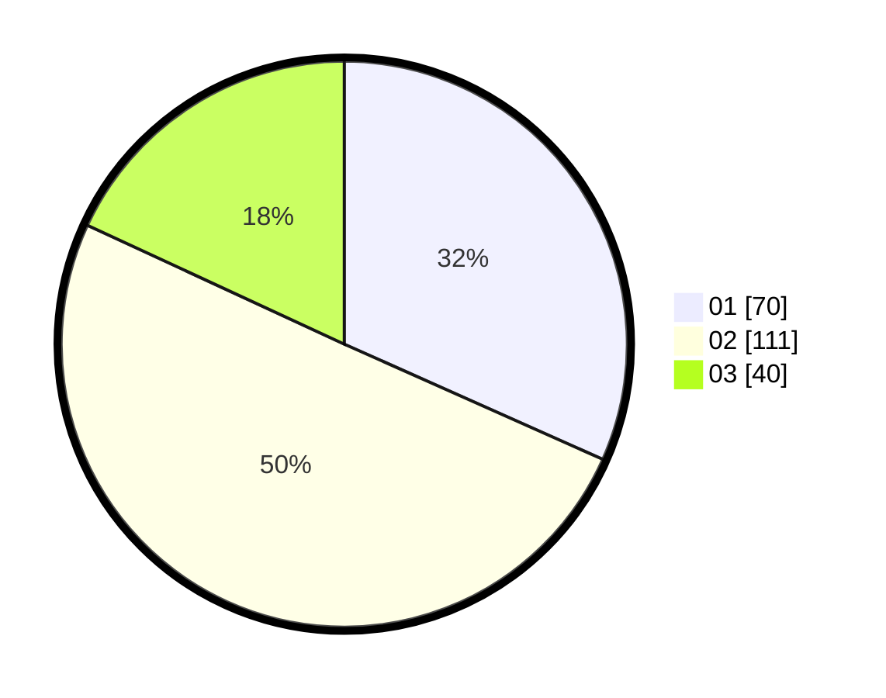

# Hasil

Hasil perolehan suara paslon dapat dilihat pada file paslon-01.txt, paslon-02.txt, dan paslon-03.txt.

Jika tidak ada, artinya data tersebut belum ada pada SIREKAP.

## Perolehan Suara

 * Paslon 01: **70**.
 * Paslon 02: **111**.
 * Paslon 03: **40**.

## Foto C Plano

https://sirekap-obj-formc.kpu.go.id/fbbb/pemilu/ppwp/31/75/09/10/04/3175091004039-20240216-022057--01662985-4f38-46a3-ac11-13916d0ff369.jpg

https://sirekap-obj-formc.kpu.go.id/fbbb/pemilu/ppwp/31/75/09/10/04/3175091004039-20240216-022058--ddfc6c36-11a7-48e4-ab49-0595673af141.jpg

https://sirekap-obj-formc.kpu.go.id/fbbb/pemilu/ppwp/31/75/09/10/04/3175091004039-20240216-022057--e2cdd22e-8ccb-46fb-80a7-246df92b135d.jpg

## DATA PEMILIH TETAP

Jumlah pemilih dalam DPT: **271**.
 * L: **134**.
 * P: **137**.

## DATA PENGGUNA HAK PILIH

Jumlah pengguna hak pilih dalam DPT: **221**.
 * L: **108**.
 * P: **113**.

Jumlah pengguna hak pilih dalam DPTb: **1**.
 * L: **0**.
 * P: **1**.

Jumlah pengguna hak pilih dalam DPK: **1**.
 * L: **1**.
 * P: **0**.

Jumlah pengguna hak pilih: **223**.
 * L: **109**.
 * P: **114**.

## JUMLAH SUARA SAH DAN TIDAK SAH

JUMLAH SELURUH SUARA SAH: **221**.

JUMLAH SUARA TIDAK SAH: **2**.

JUMLAH SELURUH SUARA SAH DAN SUARA TIDAK SAH: **223**.
