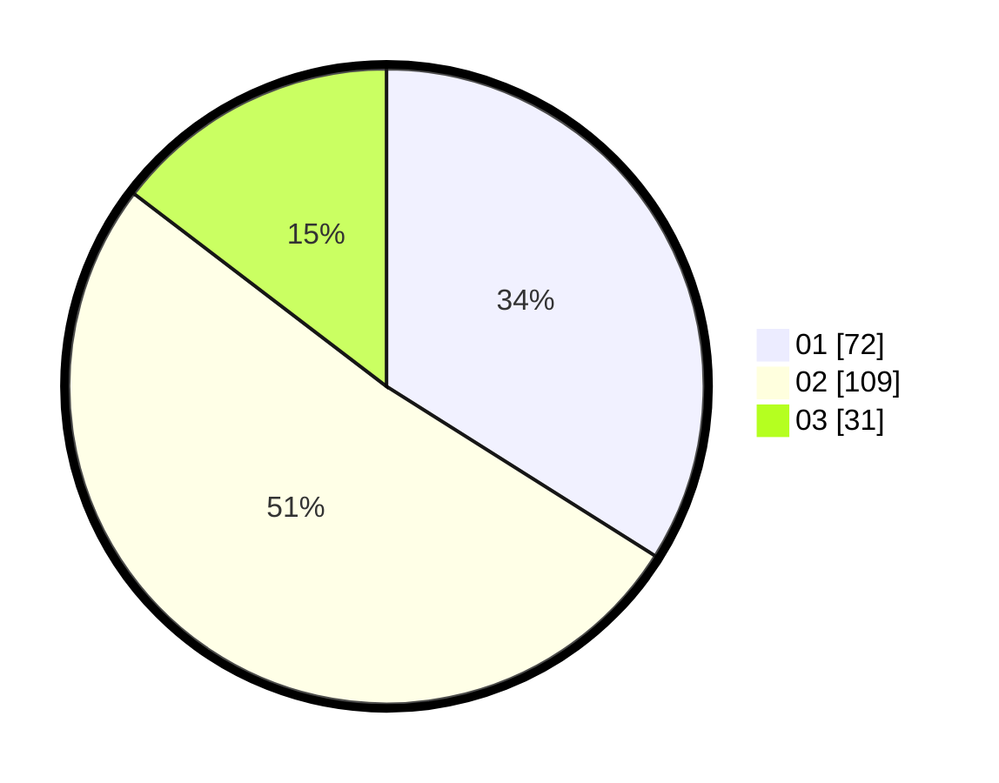

# Hasil

Hasil perolehan suara paslon dapat dilihat pada file paslon-01.txt, paslon-02.txt, dan paslon-03.txt.

Jika tidak ada, artinya data tersebut belum ada pada SIREKAP.

## Perolehan Suara

 * Paslon 01: **72**.
 * Paslon 02: **109**.
 * Paslon 03: **31**.

## Foto C Plano

https://sirekap-obj-formc.kpu.go.id/e042/pemilu/ppwp/31/75/09/10/04/3175091004040-20240215-225533--4e95a6b3-85cc-472b-bd59-d5b4af3b7396.jpg

https://sirekap-obj-formc.kpu.go.id/e042/pemilu/ppwp/31/75/09/10/04/3175091004040-20240215-225535--13f5cb99-40a8-4b4e-9dc8-2da97941d5f9.jpg

https://sirekap-obj-formc.kpu.go.id/e042/pemilu/ppwp/31/75/09/10/04/3175091004040-20240215-225534--67e4176e-871a-4236-9d20-aaa3be06f7f3.jpg

## DATA PEMILIH TETAP

Jumlah pemilih dalam DPT: **269**.
 * L: **137**.
 * P: **132**.

## DATA PENGGUNA HAK PILIH

Jumlah pengguna hak pilih dalam DPT: **212**.
 * L: **111**.
 * P: **101**.

Jumlah pengguna hak pilih dalam DPTb: **6**.
 * L: **3**.
 * P: **3**.

Jumlah pengguna hak pilih dalam DPK: **0**.
 * L: **0**.
 * P: **0**.

Jumlah pengguna hak pilih: **218**.
 * L: **114**.
 * P: **104**.

## JUMLAH SUARA SAH DAN TIDAK SAH

JUMLAH SELURUH SUARA SAH: **212**.

JUMLAH SUARA TIDAK SAH: **6**.

JUMLAH SELURUH SUARA SAH DAN SUARA TIDAK SAH: **218**.
