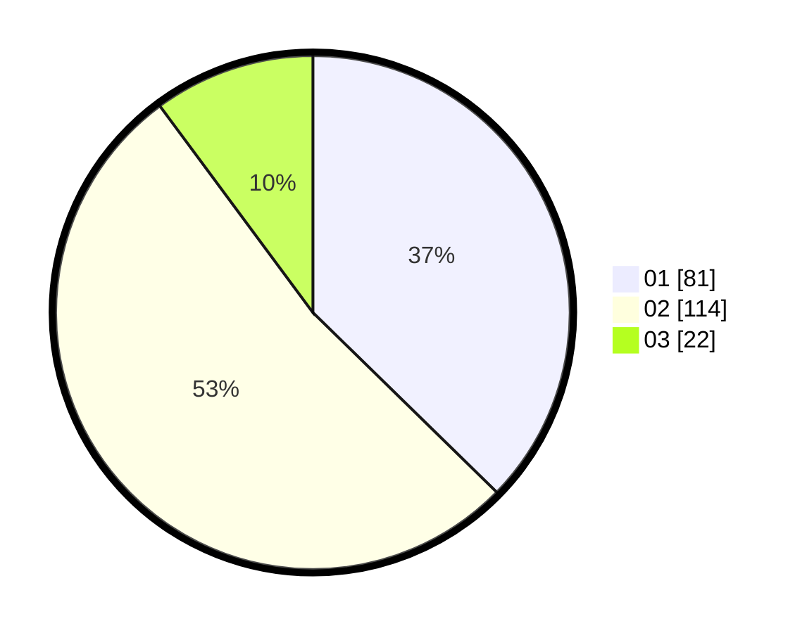

# Hasil

Hasil perolehan suara paslon dapat dilihat pada file paslon-01.txt, paslon-02.txt, dan paslon-03.txt.

Jika tidak ada, artinya data tersebut belum ada pada SIREKAP.

## Perolehan Suara

 * Paslon 01: **81**.
 * Paslon 02: **114**.
 * Paslon 03: **22**.

## Foto C Plano

https://sirekap-obj-formc.kpu.go.id/8a01/pemilu/ppwp/31/75/09/10/04/3175091004042-20240214-184457--27f0774e-16f6-4255-b233-372a18dd339c.jpg

https://sirekap-obj-formc.kpu.go.id/8a01/pemilu/ppwp/31/75/09/10/04/3175091004042-20240214-185940--bb65b598-c19e-440e-b81d-9e1112b65ea8.jpg

https://sirekap-obj-formc.kpu.go.id/8a01/pemilu/ppwp/31/75/09/10/04/3175091004042-20240214-191334--8a64a459-baa2-4d29-94b7-b389bd838527.jpg

## DATA PEMILIH TETAP

Jumlah pemilih dalam DPT: **272**.
 * L: **135**.
 * P: **137**.

## DATA PENGGUNA HAK PILIH

Jumlah pengguna hak pilih dalam DPT: **219**.
 * L: **106**.
 * P: **113**.

Jumlah pengguna hak pilih dalam DPTb: **2**.
 * L: **1**.
 * P: **1**.

Jumlah pengguna hak pilih dalam DPK: **1**.
 * L: **0**.
 * P: **1**.

Jumlah pengguna hak pilih: **222**.
 * L: **107**.
 * P: **115**.

## JUMLAH SUARA SAH DAN TIDAK SAH

JUMLAH SELURUH SUARA SAH: **217**.

JUMLAH SUARA TIDAK SAH: **45**.

JUMLAH SELURUH SUARA SAH DAN SUARA TIDAK SAH: **222**.
