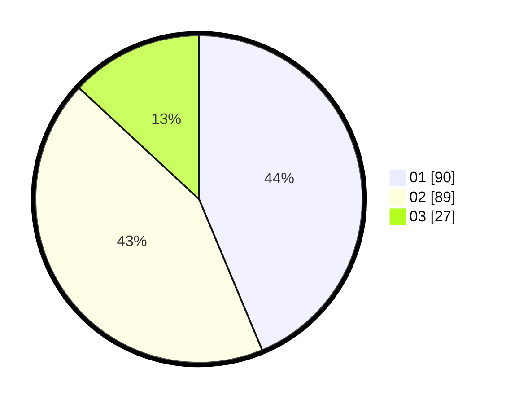

# Hasil

Hasil perolehan suara paslon dapat dilihat pada file paslon-01.txt, paslon-02.txt, dan paslon-03.txt.

Jika tidak ada, artinya data tersebut belum ada pada SIREKAP.

## Perolehan Suara

 * Paslon 01: **90**.
 * Paslon 02: **89**.
 * Paslon 03: **27**.

## Foto C Plano

https://sirekap-obj-formc.kpu.go.id/06d3/pemilu/ppwp/31/75/09/10/04/3175091004059-20240214-223721--76ba8225-9788-4370-85da-1a6538858cff.jpg

https://sirekap-obj-formc.kpu.go.id/06d3/pemilu/ppwp/31/75/09/10/04/3175091004059-20240214-223959--d35c90d9-1b2a-4342-b564-74a16c4663c1.jpg

https://sirekap-obj-formc.kpu.go.id/06d3/pemilu/ppwp/31/75/09/10/04/3175091004059-20240214-224148--9e275d78-3d56-4571-95c6-94d618a272e6.jpg

## DATA PEMILIH TETAP

Jumlah pemilih dalam DPT: **253**.
 * L: **138**.
 * P: **115**.

## DATA PENGGUNA HAK PILIH

Jumlah pengguna hak pilih dalam DPT: **207**.
 * L: **108**.
 * P: **99**.

Jumlah pengguna hak pilih dalam DPTb: **0**.
 * L: **0**.
 * P: **0**.

Jumlah pengguna hak pilih dalam DPK: **3**.
 * L: **1**.
 * P: **2**.

Jumlah pengguna hak pilih: **210**.
 * L: **109**.
 * P: **101**.

## JUMLAH SUARA SAH DAN TIDAK SAH

JUMLAH SELURUH SUARA SAH: **206**.

JUMLAH SUARA TIDAK SAH: **4**.

JUMLAH SELURUH SUARA SAH DAN SUARA TIDAK SAH: **210**.
