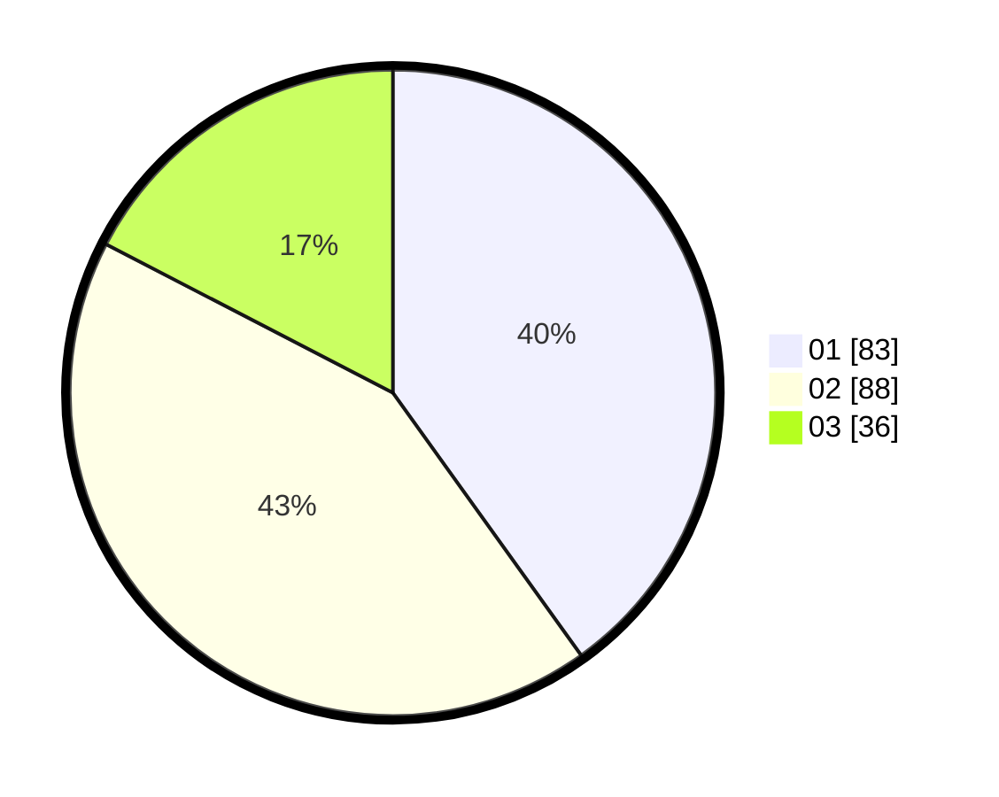

# Hasil

Hasil perolehan suara paslon dapat dilihat pada file paslon-01.txt, paslon-02.txt, dan paslon-03.txt.

Jika tidak ada, artinya data tersebut belum ada pada SIREKAP.

## Perolehan Suara

 * Paslon 01: **83**.
 * Paslon 02: **88**.
 * Paslon 03: **36**.

## Foto C Plano

https://sirekap-obj-formc.kpu.go.id/0e11/pemilu/ppwp/31/75/09/10/04/3175091004066-20240216-124742--7a274961-5e82-4a35-b71d-fd7971d39131.jpg

https://sirekap-obj-formc.kpu.go.id/0e11/pemilu/ppwp/31/75/09/10/04/3175091004066-20240214-141556--780e4363-71b5-4389-889e-892ff2d2bfb9.jpg

https://sirekap-obj-formc.kpu.go.id/0e11/pemilu/ppwp/31/75/09/10/04/3175091004066-20240216-124746--2b97f93a-2352-4f6c-b90a-6517d95af5f8.jpg

## DATA PEMILIH TETAP

Jumlah pemilih dalam DPT: **265**.
 * L: **152**.
 * P: **113**.

## DATA PENGGUNA HAK PILIH

Jumlah pengguna hak pilih dalam DPT: **208**.
 * L: **112**.
 * P: **96**.

Jumlah pengguna hak pilih dalam DPTb: **0**.
 * L: **0**.
 * P: **0**.

Jumlah pengguna hak pilih dalam DPK: **3**.
 * L: **1**.
 * P: **2**.

Jumlah pengguna hak pilih: **211**.
 * L: **113**.
 * P: **98**.

## JUMLAH SUARA SAH DAN TIDAK SAH

JUMLAH SELURUH SUARA SAH: **207**.

JUMLAH SUARA TIDAK SAH: **4**.

JUMLAH SELURUH SUARA SAH DAN SUARA TIDAK SAH: **211**.
