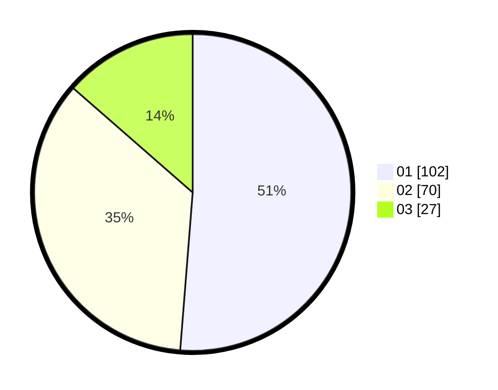

# Hasil

Hasil perolehan suara paslon dapat dilihat pada file paslon-01.txt, paslon-02.txt, dan paslon-03.txt.

Jika tidak ada, artinya data tersebut belum ada pada SIREKAP.

## Perolehan Suara

 * Paslon 01: **102**.
 * Paslon 02: **70**.
 * Paslon 03: **27**.

## Foto C Plano

https://sirekap-obj-formc.kpu.go.id/8867/pemilu/ppwp/31/75/09/10/04/3175091004069-20240214-200844--41242da8-29c0-428b-9807-ebe23e3b8ec3.jpg

https://sirekap-obj-formc.kpu.go.id/8867/pemilu/ppwp/31/75/09/10/04/3175091004069-20240214-201005--320720ad-eec0-4185-8cb4-67a1d2cc1072.jpg

https://sirekap-obj-formc.kpu.go.id/8867/pemilu/ppwp/31/75/09/10/04/3175091004069-20240214-201057--ed81b89e-95c0-4132-88ef-eb9bffc910eb.jpg

## DATA PEMILIH TETAP

Jumlah pemilih dalam DPT: **245**.
 * L: **122**.
 * P: **123**.

## DATA PENGGUNA HAK PILIH

Jumlah pengguna hak pilih dalam DPT: **197**.
 * L: **92**.
 * P: **105**.

Jumlah pengguna hak pilih dalam DPTb: **3**.
 * L: **1**.
 * P: **2**.

Jumlah pengguna hak pilih dalam DPK: **3**.
 * L: **2**.
 * P: **1**.

Jumlah pengguna hak pilih: **203**.
 * L: **95**.
 * P: **108**.

## JUMLAH SUARA SAH DAN TIDAK SAH

JUMLAH SELURUH SUARA SAH: **199**.

JUMLAH SUARA TIDAK SAH: **4**.

JUMLAH SELURUH SUARA SAH DAN SUARA TIDAK SAH: **203**.
