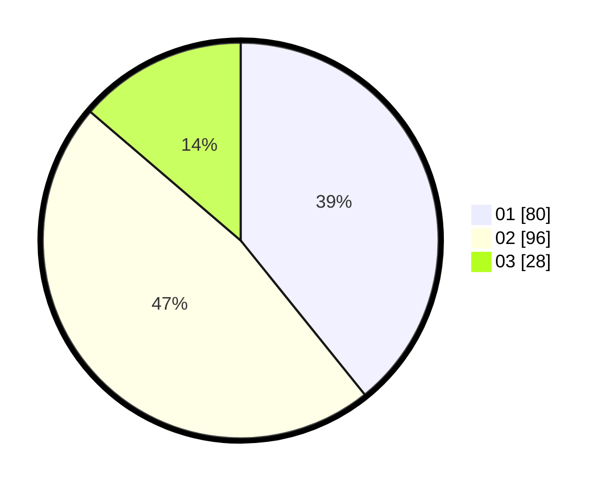

# Hasil

Hasil perolehan suara paslon dapat dilihat pada file paslon-01.txt, paslon-02.txt, dan paslon-03.txt.

Jika tidak ada, artinya data tersebut belum ada pada SIREKAP.

## Perolehan Suara

 * Paslon 01: **80**.
 * Paslon 02: **96**.
 * Paslon 03: **28**.

## Foto C Plano

https://sirekap-obj-formc.kpu.go.id/dde6/pemilu/ppwp/31/75/09/10/04/3175091004070-20240215-214533--bba14f90-5714-4b1e-a264-54c5b85a2ba6.jpg

https://sirekap-obj-formc.kpu.go.id/dde6/pemilu/ppwp/31/75/09/10/04/3175091004070-20240214-192737--6dfeeadb-b945-48b4-98b2-6444c1ff5b5f.jpg

https://sirekap-obj-formc.kpu.go.id/dde6/pemilu/ppwp/31/75/09/10/04/3175091004070-20240214-191829--eb7c14d3-d841-49f5-b31d-ae409dd3176e.jpg

## DATA PEMILIH TETAP

Jumlah pemilih dalam DPT: **0**.
 * L: **0**.
 * P: **0**.

## DATA PENGGUNA HAK PILIH

Jumlah pengguna hak pilih dalam DPT: **0**.
 * L: **0**.
 * P: **0**.

Jumlah pengguna hak pilih dalam DPTb: **0**.
 * L: **0**.
 * P: **0**.

Jumlah pengguna hak pilih dalam DPK: **0**.
 * L: **0**.
 * P: **0**.

Jumlah pengguna hak pilih: **0**.
 * L: **0**.
 * P: **0**.

## JUMLAH SUARA SAH DAN TIDAK SAH

JUMLAH SELURUH SUARA SAH: **204**.

JUMLAH SUARA TIDAK SAH: **0**.

JUMLAH SELURUH SUARA SAH DAN SUARA TIDAK SAH: **204**.
