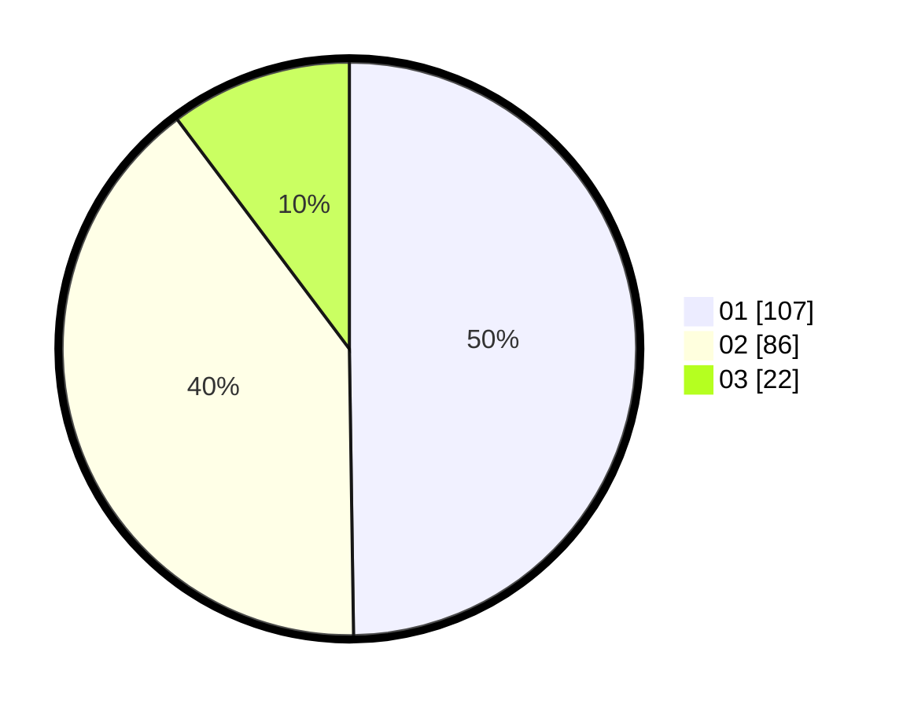

# Hasil

Hasil perolehan suara paslon dapat dilihat pada file paslon-01.txt, paslon-02.txt, dan paslon-03.txt.

Jika tidak ada, artinya data tersebut belum ada pada SIREKAP.

## Perolehan Suara

 * Paslon 01: **107**.
 * Paslon 02: **86**.
 * Paslon 03: **22**.

## Foto C Plano

https://sirekap-obj-formc.kpu.go.id/c3ee/pemilu/ppwp/31/75/09/10/04/3175091004073-20240214-155814--5e026b96-c873-4372-b1dc-21ad23d0e075.jpg

https://sirekap-obj-formc.kpu.go.id/c3ee/pemilu/ppwp/31/75/09/10/04/3175091004073-20240214-155900--39961dd0-817e-4ddc-a39d-e16c32011444.jpg

https://sirekap-obj-formc.kpu.go.id/c3ee/pemilu/ppwp/31/75/09/10/04/3175091004073-20240214-155918--2bb72dfd-af12-4d31-8822-5fa430027a91.jpg

## DATA PEMILIH TETAP

Jumlah pemilih dalam DPT: **257**.
 * L: **127**.
 * P: **130**.

## DATA PENGGUNA HAK PILIH

Jumlah pengguna hak pilih dalam DPT: **214**.
 * L: **103**.
 * P: **111**.

Jumlah pengguna hak pilih dalam DPTb: **2**.
 * L: **1**.
 * P: **1**.

Jumlah pengguna hak pilih dalam DPK: **0**.
 * L: **0**.
 * P: **0**.

Jumlah pengguna hak pilih: **216**.
 * L: **104**.
 * P: **112**.

## JUMLAH SUARA SAH DAN TIDAK SAH

JUMLAH SELURUH SUARA SAH: **215**.

JUMLAH SUARA TIDAK SAH: **1**.

JUMLAH SELURUH SUARA SAH DAN SUARA TIDAK SAH: **216**.
