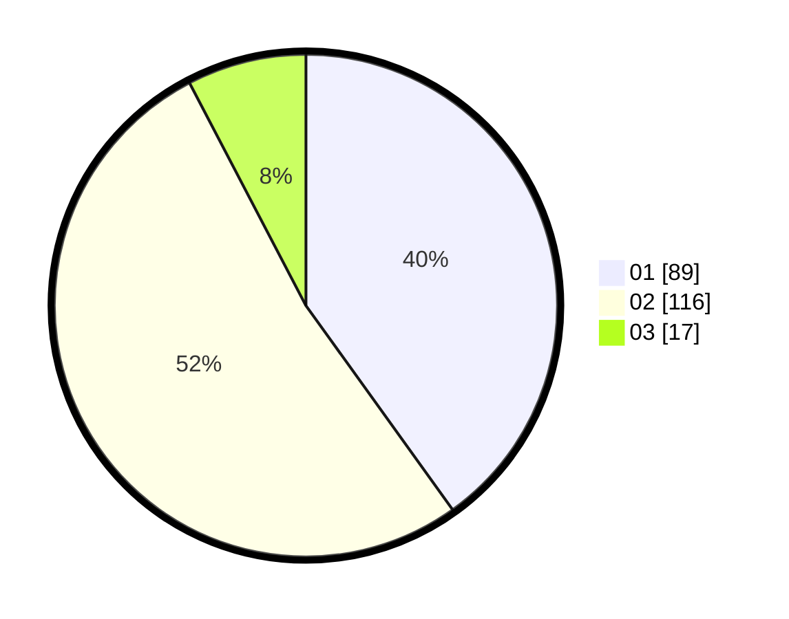

# Hasil

Hasil perolehan suara paslon dapat dilihat pada file paslon-01.txt, paslon-02.txt, dan paslon-03.txt.

Jika tidak ada, artinya data tersebut belum ada pada SIREKAP.

## Perolehan Suara

 * Paslon 01: **89**.
 * Paslon 02: **116**.
 * Paslon 03: **17**.

## Foto C Plano

https://sirekap-obj-formc.kpu.go.id/2bc6/pemilu/ppwp/31/75/09/10/04/3175091004079-20240214-192236--edb07200-3e9b-408a-9e2a-6c7bdac48c75.jpg

https://sirekap-obj-formc.kpu.go.id/2bc6/pemilu/ppwp/31/75/09/10/04/3175091004079-20240214-192402--e163e673-48de-453e-ae45-42638ac8e69b.jpg

https://sirekap-obj-formc.kpu.go.id/2bc6/pemilu/ppwp/31/75/09/10/04/3175091004079-20240214-192506--93a03c5c-ba33-4520-abd9-7d3a5037f05e.jpg
