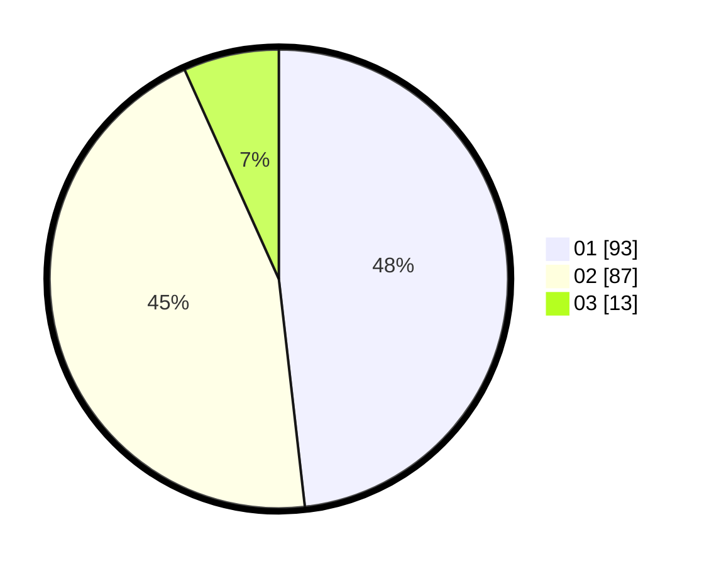

# Hasil

Hasil perolehan suara paslon dapat dilihat pada file paslon-01.txt, paslon-02.txt, dan paslon-03.txt.

Jika tidak ada, artinya data tersebut belum ada pada SIREKAP.

## Perolehan Suara

 * Paslon 01: **93**.
 * Paslon 02: **87**.
 * Paslon 03: **13**.

## Foto C Plano

https://sirekap-obj-formc.kpu.go.id/8c29/pemilu/ppwp/31/75/09/10/04/3175091004080-20240215-221421--5c33e81c-a4d7-4bc3-b488-b5ac5f1fb272.jpg

https://sirekap-obj-formc.kpu.go.id/8c29/pemilu/ppwp/31/75/09/10/04/3175091004080-20240215-221423--2decbf80-7ddf-408c-a66a-28d40b97b035.jpg

https://sirekap-obj-formc.kpu.go.id/8c29/pemilu/ppwp/31/75/09/10/04/3175091004080-20240215-221422--a7a46c7b-3b52-4991-b800-1594ac4c62d8.jpg

## DATA PEMILIH TETAP

Jumlah pemilih dalam DPT: **255**.
 * L: **124**.
 * P: **131**.

## DATA PENGGUNA HAK PILIH

Jumlah pengguna hak pilih dalam DPT: **198**.
 * L: **95**.
 * P: **103**.

Jumlah pengguna hak pilih dalam DPTb: **0**.
 * L: **0**.
 * P: **0**.

Jumlah pengguna hak pilih dalam DPK: **1**.
 * L: **1**.
 * P: **0**.

Jumlah pengguna hak pilih: **199**.
 * L: **96**.
 * P: **103**.

## JUMLAH SUARA SAH DAN TIDAK SAH

JUMLAH SELURUH SUARA SAH: **193**.

JUMLAH SUARA TIDAK SAH: **6**.

JUMLAH SELURUH SUARA SAH DAN SUARA TIDAK SAH: **199**.
