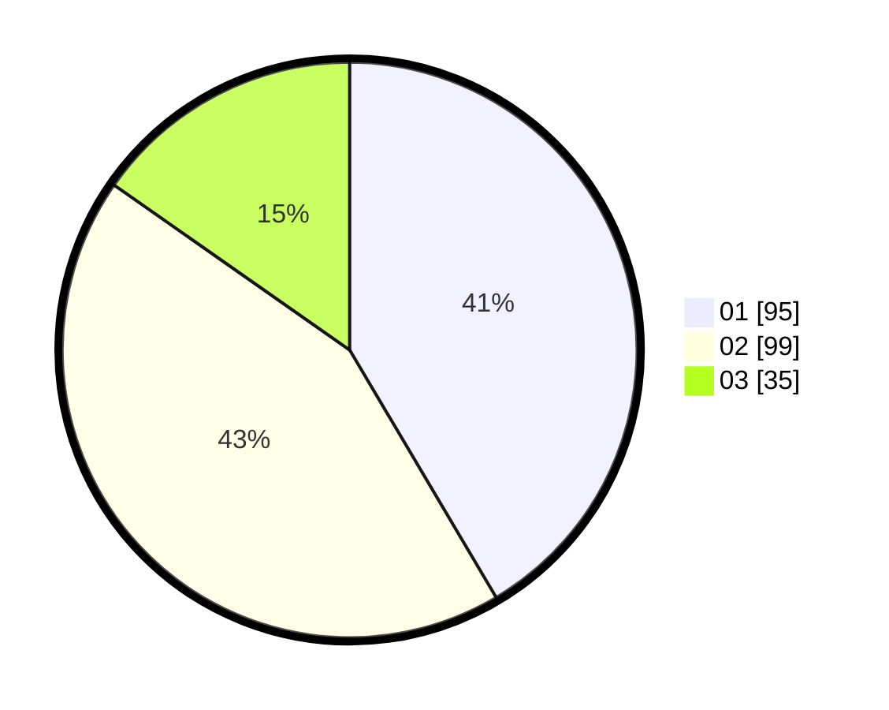

# Hasil

Hasil perolehan suara paslon dapat dilihat pada file paslon-01.txt, paslon-02.txt, dan paslon-03.txt.

Jika tidak ada, artinya data tersebut belum ada pada SIREKAP.

## Perolehan Suara

 * Paslon 01: **95**.
 * Paslon 02: **99**.
 * Paslon 03: **35**.

## Foto C Plano

https://sirekap-obj-formc.kpu.go.id/fa17/pemilu/ppwp/31/75/09/10/04/3175091004081-20240216-004433--a70d5cbf-5277-4ff8-b35c-ffcf57237a60.jpg

https://sirekap-obj-formc.kpu.go.id/fa17/pemilu/ppwp/31/75/09/10/04/3175091004081-20240216-004442--de923e36-4230-4abf-a290-1edc8818da96.jpg

https://sirekap-obj-formc.kpu.go.id/fa17/pemilu/ppwp/31/75/09/10/04/3175091004081-20240216-004438--912e35bf-dfd3-4a8a-b1aa-2aad52127177.jpg

## DATA PEMILIH TETAP

Jumlah pemilih dalam DPT: **268**.
 * L: **130**.
 * P: **138**.

## DATA PENGGUNA HAK PILIH

Jumlah pengguna hak pilih dalam DPT: **231**.
 * L: **114**.
 * P: **117**.

Jumlah pengguna hak pilih dalam DPTb: **0**.
 * L: **0**.
 * P: **0**.

Jumlah pengguna hak pilih dalam DPK: **1**.
 * L: **0**.
 * P: **1**.

Jumlah pengguna hak pilih: **232**.
 * L: **114**.
 * P: **118**.

## JUMLAH SUARA SAH DAN TIDAK SAH

JUMLAH SELURUH SUARA SAH: **229**.

JUMLAH SUARA TIDAK SAH: **3**.

JUMLAH SELURUH SUARA SAH DAN SUARA TIDAK SAH: **232**.
