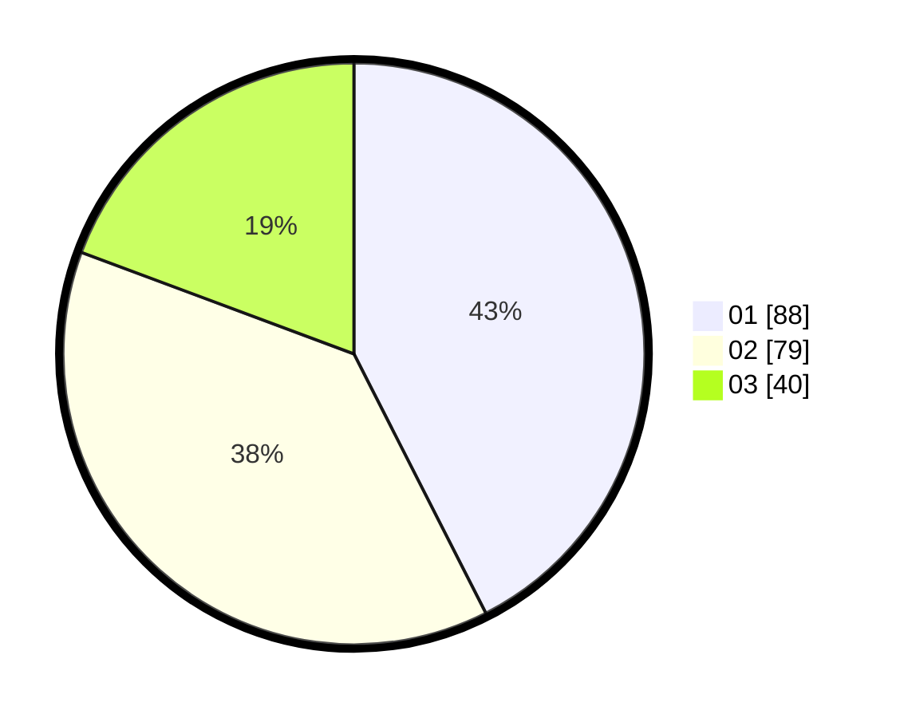

# Hasil

Hasil perolehan suara paslon dapat dilihat pada file paslon-01.txt, paslon-02.txt, dan paslon-03.txt.

Jika tidak ada, artinya data tersebut belum ada pada SIREKAP.

## Perolehan Suara

 * Paslon 01: **88**.
 * Paslon 02: **79**.
 * Paslon 03: **40**.

## Foto C Plano

https://sirekap-obj-formc.kpu.go.id/7594/pemilu/ppwp/31/75/09/10/04/3175091004082-20240216-085128--67f7198d-d0f6-4617-ad73-1217ec7c7030.jpg

https://sirekap-obj-formc.kpu.go.id/7594/pemilu/ppwp/31/75/09/10/04/3175091004082-20240216-085141--c88a95d2-308c-46e1-ab72-b345a7a55f9a.jpg

https://sirekap-obj-formc.kpu.go.id/7594/pemilu/ppwp/31/75/09/10/04/3175091004082-20240216-085138--78134970-d54a-4333-8b7f-fb23c951dd76.jpg

## DATA PEMILIH TETAP

Jumlah pemilih dalam DPT: **264**.
 * L: **135**.
 * P: **129**.

## DATA PENGGUNA HAK PILIH

Jumlah pengguna hak pilih dalam DPT: **207**.
 * L: **100**.
 * P: **107**.

Jumlah pengguna hak pilih dalam DPTb: **2**.
 * L: **0**.
 * P: **2**.

Jumlah pengguna hak pilih dalam DPK: **2**.
 * L: **2**.
 * P: **0**.

Jumlah pengguna hak pilih: **211**.
 * L: **102**.
 * P: **109**.

## JUMLAH SUARA SAH DAN TIDAK SAH

JUMLAH SELURUH SUARA SAH: **207**.

JUMLAH SUARA TIDAK SAH: **4**.

JUMLAH SELURUH SUARA SAH DAN SUARA TIDAK SAH: **211**.
