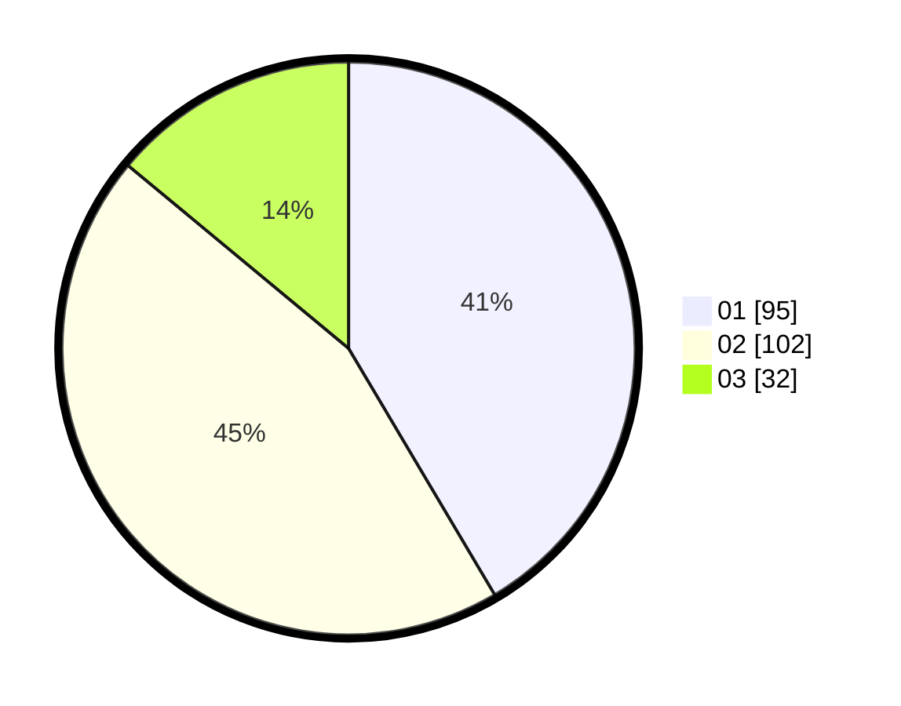

# Hasil

Hasil perolehan suara paslon dapat dilihat pada file paslon-01.txt, paslon-02.txt, dan paslon-03.txt.

Jika tidak ada, artinya data tersebut belum ada pada SIREKAP.

## Perolehan Suara

 * Paslon 01: **95**.
 * Paslon 02: **102**.
 * Paslon 03: **32**.

## Foto C Plano

https://sirekap-obj-formc.kpu.go.id/90b0/pemilu/ppwp/31/75/09/10/04/3175091004085-20240216-133406--4a1045ab-1f80-460b-b849-a255a0368adf.jpg

https://sirekap-obj-formc.kpu.go.id/90b0/pemilu/ppwp/31/75/09/10/04/3175091004085-20240216-133408--f43575a0-f4e8-4f32-8397-f257dfb6318d.jpg

https://sirekap-obj-formc.kpu.go.id/90b0/pemilu/ppwp/31/75/09/10/04/3175091004085-20240216-133407--18c36fb4-2790-4a9d-a01a-1f326a0de5e8.jpg

## DATA PEMILIH TETAP

Jumlah pemilih dalam DPT: **268**.
 * L: **119**.
 * P: **149**.

## DATA PENGGUNA HAK PILIH

Jumlah pengguna hak pilih dalam DPT: **225**.
 * L: **98**.
 * P: **127**.

Jumlah pengguna hak pilih dalam DPTb: **4**.
 * L: **1**.
 * P: **3**.

Jumlah pengguna hak pilih dalam DPK: **0**.
 * L: **0**.
 * P: **0**.

Jumlah pengguna hak pilih: **229**.
 * L: **99**.
 * P: **130**.

## JUMLAH SUARA SAH DAN TIDAK SAH

JUMLAH SELURUH SUARA SAH: **229**.

JUMLAH SUARA TIDAK SAH: **0**.

JUMLAH SELURUH SUARA SAH DAN SUARA TIDAK SAH: **229**.
