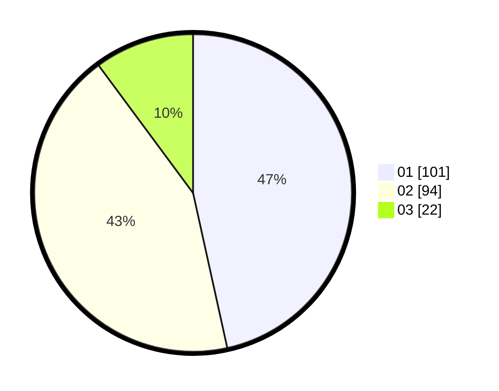

# Hasil

Hasil perolehan suara paslon dapat dilihat pada file paslon-01.txt, paslon-02.txt, dan paslon-03.txt.

Jika tidak ada, artinya data tersebut belum ada pada SIREKAP.

## Perolehan Suara

 * Paslon 01: **101**.
 * Paslon 02: **94**.
 * Paslon 03: **22**.

## Foto C Plano

https://sirekap-obj-formc.kpu.go.id/ada2/pemilu/ppwp/31/75/09/10/04/3175091004093-20240215-214840--987401c7-7b4d-4842-8b8e-ae868465285a.jpg

https://sirekap-obj-formc.kpu.go.id/ada2/pemilu/ppwp/31/75/09/10/04/3175091004093-20240214-141253--10813c22-77b4-4f53-8f24-6e056f890c70.jpg

https://sirekap-obj-formc.kpu.go.id/ada2/pemilu/ppwp/31/75/09/10/04/3175091004093-20240215-214842--25ad3871-a3b3-42ed-b930-9a0e96dcaf4f.jpg

## DATA PEMILIH TETAP

Jumlah pemilih dalam DPT: **260**.
 * L: **128**.
 * P: **132**.

## DATA PENGGUNA HAK PILIH

Jumlah pengguna hak pilih dalam DPT: **208**.
 * L: **99**.
 * P: **109**.

Jumlah pengguna hak pilih dalam DPTb: **4**.
 * L: **3**.
 * P: **1**.

Jumlah pengguna hak pilih dalam DPK: **6**.
 * L: **3**.
 * P: **3**.

Jumlah pengguna hak pilih: **218**.
 * L: **105**.
 * P: **113**.

## JUMLAH SUARA SAH DAN TIDAK SAH

JUMLAH SELURUH SUARA SAH: **217**.

JUMLAH SUARA TIDAK SAH: **1**.

JUMLAH SELURUH SUARA SAH DAN SUARA TIDAK SAH: **218**.
