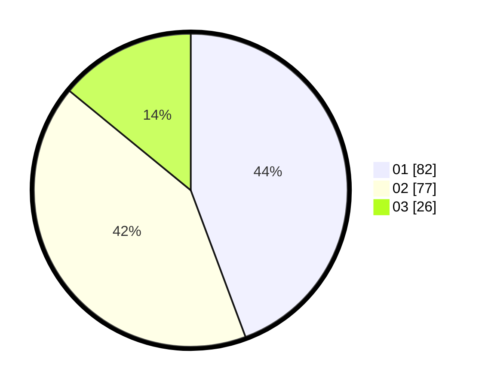

# Hasil

Hasil perolehan suara paslon dapat dilihat pada file paslon-01.txt, paslon-02.txt, dan paslon-03.txt.

Jika tidak ada, artinya data tersebut belum ada pada SIREKAP.

## Perolehan Suara

 * Paslon 01: **82**.
 * Paslon 02: **77**.
 * Paslon 03: **26**.

## Foto C Plano

https://sirekap-obj-formc.kpu.go.id/0ed5/pemilu/ppwp/31/75/09/10/04/3175091004098-20240216-020809--3a82ce32-dac5-4f3e-8189-4000b65a7876.jpg

https://sirekap-obj-formc.kpu.go.id/0ed5/pemilu/ppwp/31/75/09/10/04/3175091004098-20240216-020814--2cbaac79-07c6-48d4-90ad-5c277610f629.jpg

https://sirekap-obj-formc.kpu.go.id/0ed5/pemilu/ppwp/31/75/09/10/04/3175091004098-20240216-020813--60118f23-c6b5-433d-a62a-17f2dc383e65.jpg

## DATA PEMILIH TETAP

Jumlah pemilih dalam DPT: **188**.
 * L: **92**.
 * P: **96**.

## DATA PENGGUNA HAK PILIH

Jumlah pengguna hak pilih dalam DPT: **187**.
 * L: **91**.
 * P: **96**.

Jumlah pengguna hak pilih dalam DPTb: **0**.
 * L: **0**.
 * P: **0**.

Jumlah pengguna hak pilih dalam DPK: **1**.
 * L: **1**.
 * P: **0**.

Jumlah pengguna hak pilih: **188**.
 * L: **92**.
 * P: **96**.

## JUMLAH SUARA SAH DAN TIDAK SAH

JUMLAH SELURUH SUARA SAH: **185**.

JUMLAH SUARA TIDAK SAH: **3**.

JUMLAH SELURUH SUARA SAH DAN SUARA TIDAK SAH: **188**.
