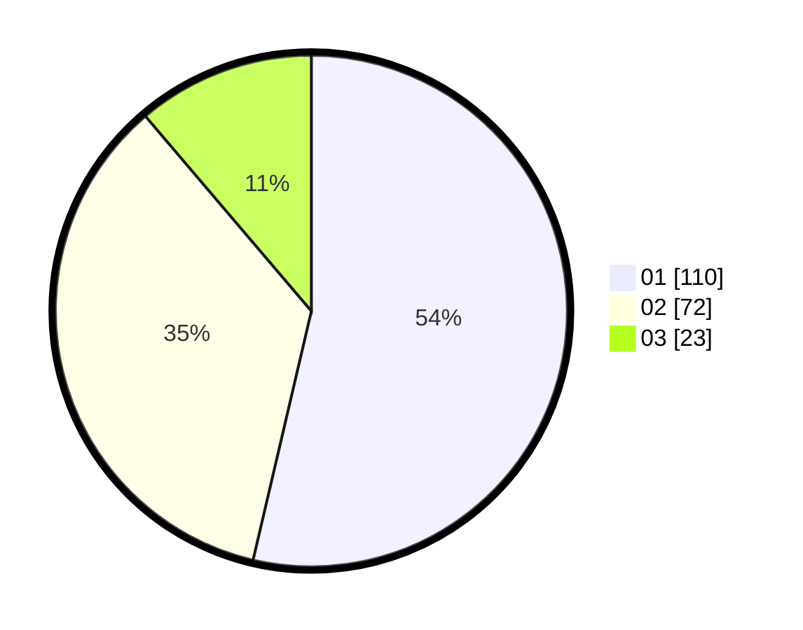

# Hasil

Hasil perolehan suara paslon dapat dilihat pada file paslon-01.txt, paslon-02.txt, dan paslon-03.txt.

Jika tidak ada, artinya data tersebut belum ada pada SIREKAP.

## Perolehan Suara

 * Paslon 01: **110**.
 * Paslon 02: **72**.
 * Paslon 03: **23**.

## Foto C Plano

https://sirekap-obj-formc.kpu.go.id/f291/pemilu/ppwp/31/75/09/10/04/3175091004101-20240214-155333--1d6eb711-674d-47f7-a32b-f8049f43f0d9.jpg

https://sirekap-obj-formc.kpu.go.id/f291/pemilu/ppwp/31/75/09/10/04/3175091004101-20240214-155128--232f4362-249d-4e4f-b7f5-11c91596e68e.jpg

https://sirekap-obj-formc.kpu.go.id/f291/pemilu/ppwp/31/75/09/10/04/3175091004101-20240214-155027--bb442a47-6355-4b50-916f-5d5a84d57944.jpg

## DATA PEMILIH TETAP

Jumlah pemilih dalam DPT: **258**.
 * L: **131**.
 * P: **127**.

## DATA PENGGUNA HAK PILIH

Jumlah pengguna hak pilih dalam DPT: **205**.
 * L: **101**.
 * P: **104**.

Jumlah pengguna hak pilih dalam DPTb: **0**.
 * L: **0**.
 * P: **0**.

Jumlah pengguna hak pilih dalam DPK: **1**.
 * L: **0**.
 * P: **1**.

Jumlah pengguna hak pilih: **206**.
 * L: **101**.
 * P: **105**.

## JUMLAH SUARA SAH DAN TIDAK SAH

JUMLAH SELURUH SUARA SAH: **205**.

JUMLAH SUARA TIDAK SAH: **1**.

JUMLAH SELURUH SUARA SAH DAN SUARA TIDAK SAH: **206**.
