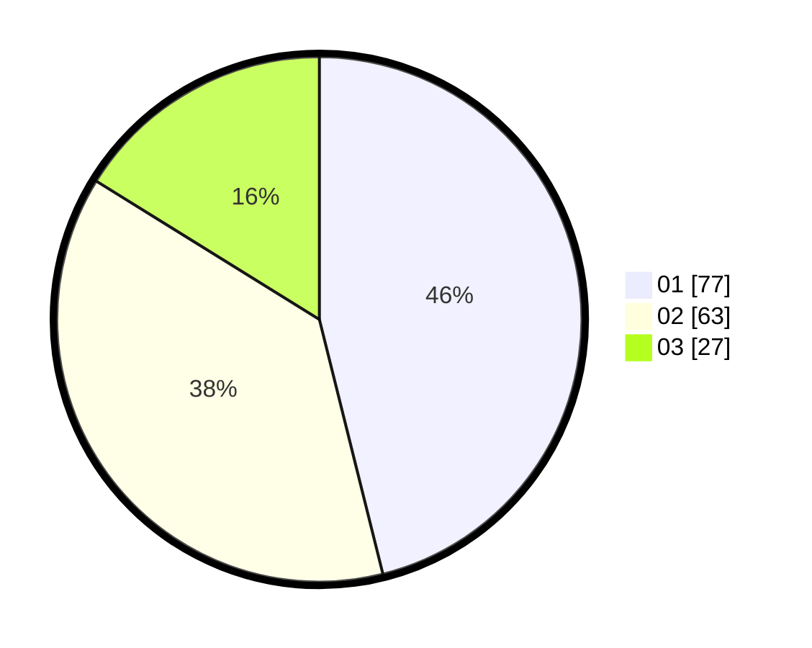

# Hasil

Hasil perolehan suara paslon dapat dilihat pada file paslon-01.txt, paslon-02.txt, dan paslon-03.txt.

Jika tidak ada, artinya data tersebut belum ada pada SIREKAP.

## Perolehan Suara

 * Paslon 01: **77**.
 * Paslon 02: **63**.
 * Paslon 03: **27**.

## Foto C Plano

https://sirekap-obj-formc.kpu.go.id/8fde/pemilu/ppwp/31/75/09/10/04/3175091004116-20240217-094604--16d18cee-956b-43e8-a5ad-5635127b9f10.jpg

https://sirekap-obj-formc.kpu.go.id/8fde/pemilu/ppwp/31/75/09/10/04/3175091004116-20240217-094605--4ce45ca6-a4de-4470-98ab-d538fa9a47bd.jpg

https://sirekap-obj-formc.kpu.go.id/8fde/pemilu/ppwp/31/75/09/10/04/3175091004116-20240217-094604--cb5aa4ff-fe01-4c22-a6b2-0e6cc6834d1f.jpg

## DATA PEMILIH TETAP

Jumlah pemilih dalam DPT: **211**.
 * L: **104**.
 * P: **107**.

## DATA PENGGUNA HAK PILIH

Jumlah pengguna hak pilih dalam DPT: **162**.
 * L: **76**.
 * P: **86**.

Jumlah pengguna hak pilih dalam DPTb: **1**.
 * L: **1**.
 * P: **0**.

Jumlah pengguna hak pilih dalam DPK: **4**.
 * L: **2**.
 * P: **2**.

Jumlah pengguna hak pilih: **167**.
 * L: **79**.
 * P: **88**.

## JUMLAH SUARA SAH DAN TIDAK SAH

JUMLAH SELURUH SUARA SAH: **167**.

JUMLAH SUARA TIDAK SAH: **0**.

JUMLAH SELURUH SUARA SAH DAN SUARA TIDAK SAH: **167**.
