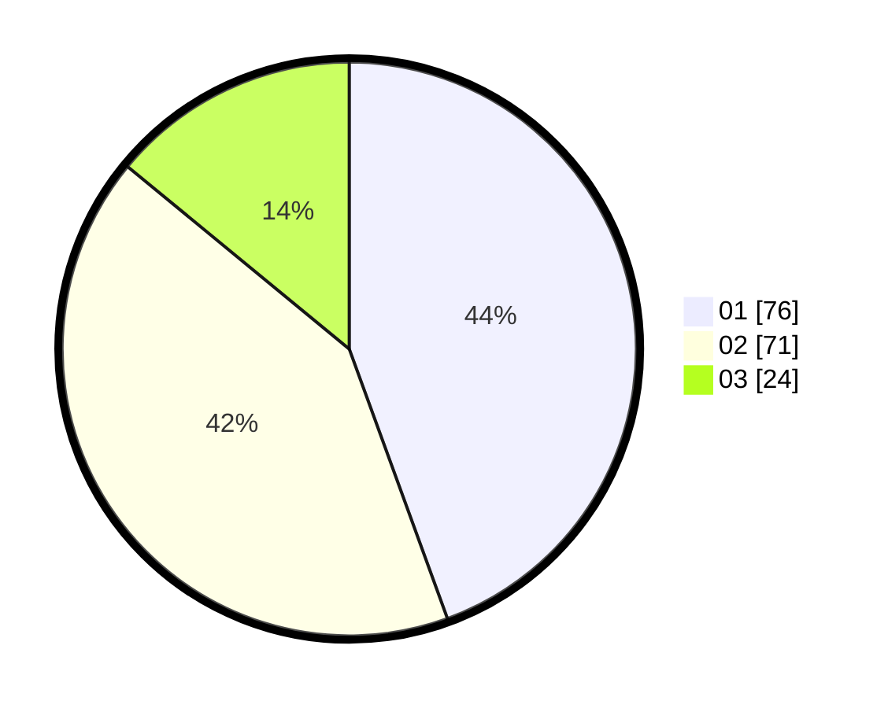

# Hasil

Hasil perolehan suara paslon dapat dilihat pada file paslon-01.txt, paslon-02.txt, dan paslon-03.txt.

Jika tidak ada, artinya data tersebut belum ada pada SIREKAP.

## Perolehan Suara

 * Paslon 01: **76**.
 * Paslon 02: **71**.
 * Paslon 03: **24**.

## Foto C Plano

https://sirekap-obj-formc.kpu.go.id/5744/pemilu/ppwp/31/75/09/10/04/3175091004118-20240216-084651--79eae0f3-2320-41d1-96b7-d9f8930af6ff.jpg

https://sirekap-obj-formc.kpu.go.id/5744/pemilu/ppwp/31/75/09/10/04/3175091004118-20240216-074116--4403fce3-c80b-478f-9ee7-4e3aa6e002d0.jpg

https://sirekap-obj-formc.kpu.go.id/5744/pemilu/ppwp/31/75/09/10/04/3175091004118-20240216-074110--0450f11d-33eb-4886-88c4-964d50af480b.jpg

## DATA PEMILIH TETAP

Jumlah pemilih dalam DPT: **209**.
 * L: **107**.
 * P: **102**.

## DATA PENGGUNA HAK PILIH

Jumlah pengguna hak pilih dalam DPT: **162**.
 * L: **82**.
 * P: **80**.

Jumlah pengguna hak pilih dalam DPTb: **5**.
 * L: **0**.
 * P: **5**.

Jumlah pengguna hak pilih dalam DPK: **4**.
 * L: **2**.
 * P: **2**.

Jumlah pengguna hak pilih: **171**.
 * L: **84**.
 * P: **87**.

## JUMLAH SUARA SAH DAN TIDAK SAH

JUMLAH SELURUH SUARA SAH: **171**.

JUMLAH SUARA TIDAK SAH: **0**.

JUMLAH SELURUH SUARA SAH DAN SUARA TIDAK SAH: **171**.
