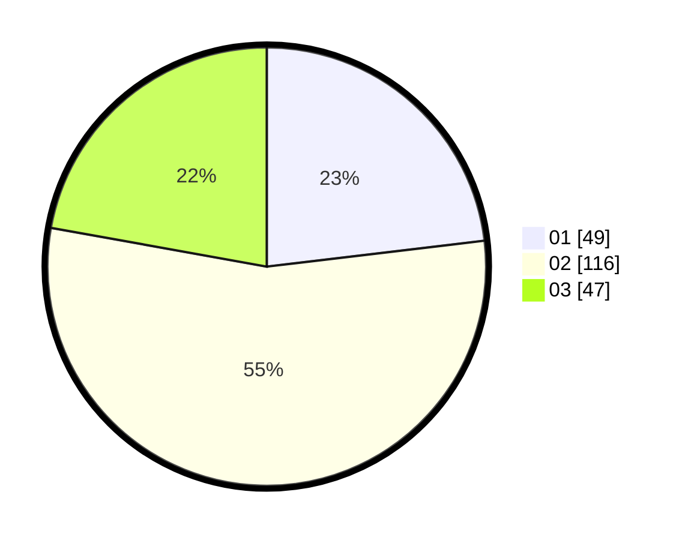

# Hasil

Hasil perolehan suara paslon dapat dilihat pada file paslon-01.txt, paslon-02.txt, dan paslon-03.txt.

Jika tidak ada, artinya data tersebut belum ada pada SIREKAP.

## Perolehan Suara

 * Paslon 01: **49**.
 * Paslon 02: **116**.
 * Paslon 03: **47**.

## Foto C Plano

https://sirekap-obj-formc.kpu.go.id/a30c/pemilu/ppwp/31/75/09/10/04/3175091004129-20240214-211522--85d4580f-f1a2-49e6-8a0c-389edfe13f62.jpg

https://sirekap-obj-formc.kpu.go.id/a30c/pemilu/ppwp/31/75/09/10/04/3175091004129-20240214-211614--dc8c6394-5aef-4a49-8ddd-5e2d010adc6d.jpg

https://sirekap-obj-formc.kpu.go.id/a30c/pemilu/ppwp/31/75/09/10/04/3175091004129-20240214-211659--4c4b14e3-3a41-4d14-ab83-c0a95cad0863.jpg

## DATA PEMILIH TETAP

Jumlah pemilih dalam DPT: **262**.
 * L: **126**.
 * P: **136**.

## DATA PENGGUNA HAK PILIH

Jumlah pengguna hak pilih dalam DPT: **211**.
 * L: **97**.
 * P: **114**.

Jumlah pengguna hak pilih dalam DPTb: **1**.
 * L: **0**.
 * P: **1**.

Jumlah pengguna hak pilih dalam DPK: **0**.
 * L: **0**.
 * P: **0**.

Jumlah pengguna hak pilih: **212**.
 * L: **97**.
 * P: **115**.

## JUMLAH SUARA SAH DAN TIDAK SAH

JUMLAH SELURUH SUARA SAH: **212**.

JUMLAH SUARA TIDAK SAH: **0**.

JUMLAH SELURUH SUARA SAH DAN SUARA TIDAK SAH: **212**.
