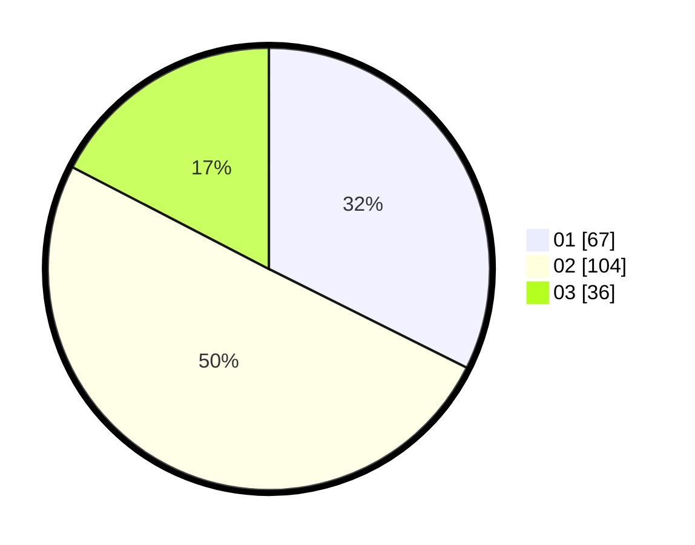

# Hasil

Hasil perolehan suara paslon dapat dilihat pada file paslon-01.txt, paslon-02.txt, dan paslon-03.txt.

Jika tidak ada, artinya data tersebut belum ada pada SIREKAP.

## Perolehan Suara

 * Paslon 01: **67**.
 * Paslon 02: **104**.
 * Paslon 03: **36**.

## Foto C Plano

https://sirekap-obj-formc.kpu.go.id/a51d/pemilu/ppwp/31/75/09/10/04/3175091004130-20240216-041936--5cb10711-ccd8-49d1-bbdf-29fdd6f53dab.jpg

https://sirekap-obj-formc.kpu.go.id/a51d/pemilu/ppwp/31/75/09/10/04/3175091004130-20240216-041937--132900bd-95b0-43d3-8006-e178013a75df.jpg

https://sirekap-obj-formc.kpu.go.id/a51d/pemilu/ppwp/31/75/09/10/04/3175091004130-20240216-041936--ace82733-4055-4875-b9e7-6c2abc6927c1.jpg

## DATA PEMILIH TETAP

Jumlah pemilih dalam DPT: **270**.
 * L: **124**.
 * P: **146**.

## DATA PENGGUNA HAK PILIH

Jumlah pengguna hak pilih dalam DPT: **201**.
 * L: **90**.
 * P: **111**.

Jumlah pengguna hak pilih dalam DPTb: **1**.
 * L: **1**.
 * P: **0**.

Jumlah pengguna hak pilih dalam DPK: **5**.
 * L: **3**.
 * P: **2**.

Jumlah pengguna hak pilih: **207**.
 * L: **94**.
 * P: **113**.

## JUMLAH SUARA SAH DAN TIDAK SAH

JUMLAH SELURUH SUARA SAH: **207**.

JUMLAH SUARA TIDAK SAH: **0**.

JUMLAH SELURUH SUARA SAH DAN SUARA TIDAK SAH: **207**.
