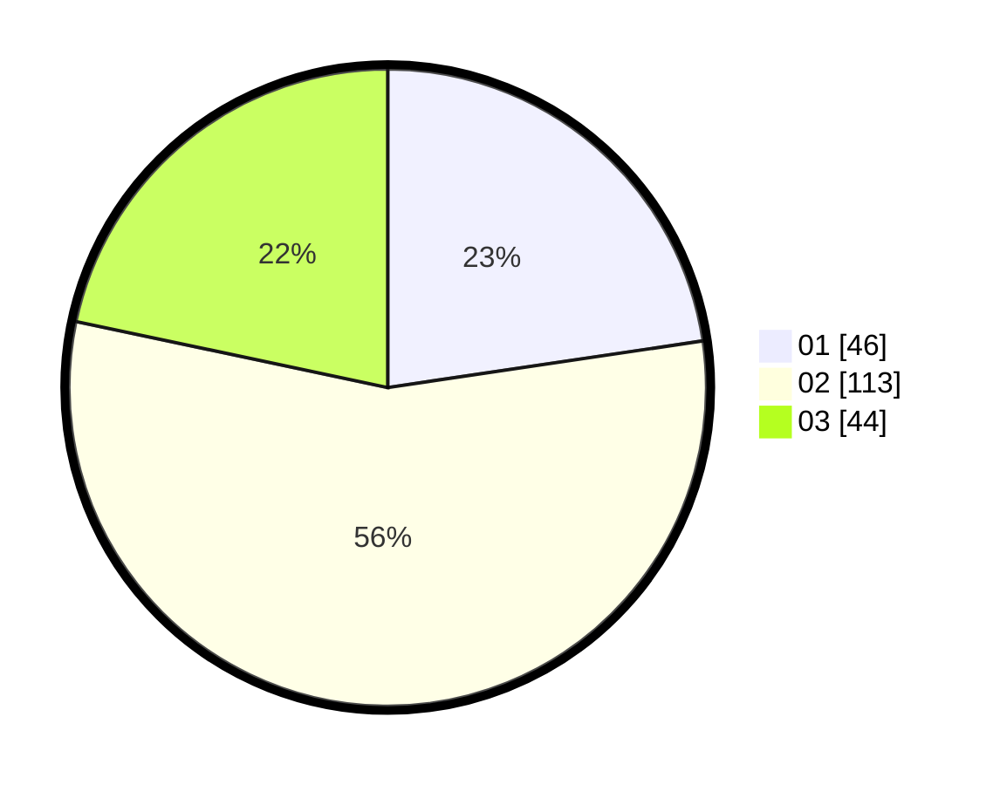

# Hasil

Hasil perolehan suara paslon dapat dilihat pada file paslon-01.txt, paslon-02.txt, dan paslon-03.txt.

Jika tidak ada, artinya data tersebut belum ada pada SIREKAP.

## Perolehan Suara

 * Paslon 01: **46**.
 * Paslon 02: **113**.
 * Paslon 03: **44**.

## Foto C Plano

https://sirekap-obj-formc.kpu.go.id/c5e0/pemilu/ppwp/31/75/09/10/05/3175091005001-20240214-215937--db13b29d-fac7-4e0e-9711-7d84aac24637.jpg

https://sirekap-obj-formc.kpu.go.id/c5e0/pemilu/ppwp/31/75/09/10/05/3175091005001-20240214-204942--f7aa482f-74e9-426e-a122-cf82a30b00d5.jpg

https://sirekap-obj-formc.kpu.go.id/c5e0/pemilu/ppwp/31/75/09/10/05/3175091005001-20240214-205043--2a7f69ad-ed9a-403f-b33c-1f4bb93674bf.jpg
