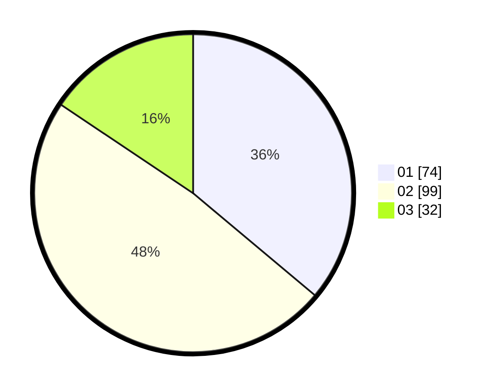

# Hasil

Hasil perolehan suara paslon dapat dilihat pada file paslon-01.txt, paslon-02.txt, dan paslon-03.txt.

Jika tidak ada, artinya data tersebut belum ada pada SIREKAP.

## Perolehan Suara

 * Paslon 01: **74**.
 * Paslon 02: **99**.
 * Paslon 03: **32**.

## Foto C Plano

https://sirekap-obj-formc.kpu.go.id/bb66/pemilu/ppwp/31/75/09/10/05/3175091005005-20240216-115456--9ec8d991-1dc2-4da6-9fe3-c037136bca4c.jpg

https://sirekap-obj-formc.kpu.go.id/bb66/pemilu/ppwp/31/75/09/10/05/3175091005005-20240216-115500--379a959c-1de1-4c5f-938c-1ac12005bac1.jpg

https://sirekap-obj-formc.kpu.go.id/bb66/pemilu/ppwp/31/75/09/10/05/3175091005005-20240216-115458--d23546ff-ccf4-4916-8943-5421a8e58b86.jpg

## DATA PEMILIH TETAP

Jumlah pemilih dalam DPT: **263**.
 * L: **116**.
 * P: **147**.

## DATA PENGGUNA HAK PILIH

Jumlah pengguna hak pilih dalam DPT: **211**.
 * L: **87**.
 * P: **124**.

Jumlah pengguna hak pilih dalam DPTb: **0**.
 * L: **0**.
 * P: **0**.

Jumlah pengguna hak pilih dalam DPK: **1**.
 * L: **1**.
 * P: **0**.

Jumlah pengguna hak pilih: **212**.
 * L: **88**.
 * P: **124**.

## JUMLAH SUARA SAH DAN TIDAK SAH

JUMLAH SELURUH SUARA SAH: **205**.

JUMLAH SUARA TIDAK SAH: **7**.

JUMLAH SELURUH SUARA SAH DAN SUARA TIDAK SAH: **212**.
