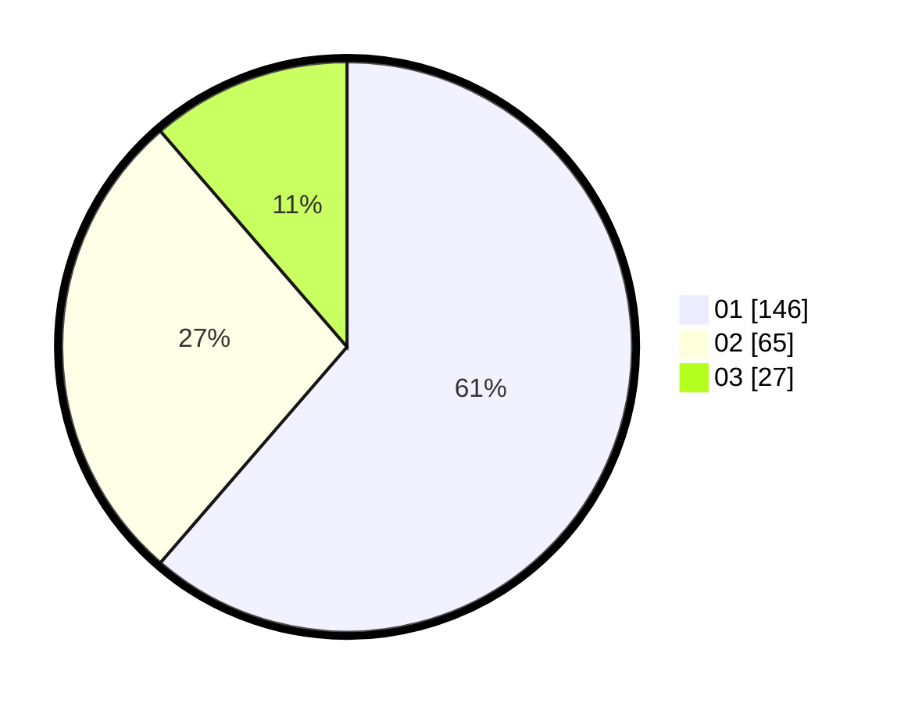

# Hasil

Hasil perolehan suara paslon dapat dilihat pada file paslon-01.txt, paslon-02.txt, dan paslon-03.txt.

Jika tidak ada, artinya data tersebut belum ada pada SIREKAP.

## Perolehan Suara

 * Paslon 01: **146**.
 * Paslon 02: **65**.
 * Paslon 03: **27**.

## Foto C Plano

https://sirekap-obj-formc.kpu.go.id/f3a6/pemilu/ppwp/31/75/09/10/05/3175091005010-20240214-215141--cc7e45dd-aeaf-4ef0-90a2-e68124a9d804.jpg

https://sirekap-obj-formc.kpu.go.id/f3a6/pemilu/ppwp/31/75/09/10/05/3175091005010-20240214-215223--2eb230c7-e13f-4988-bb53-94592855d022.jpg

https://sirekap-obj-formc.kpu.go.id/f3a6/pemilu/ppwp/31/75/09/10/05/3175091005010-20240214-215230--abb59a27-5f36-4d6f-87d4-ed465cd05876.jpg
