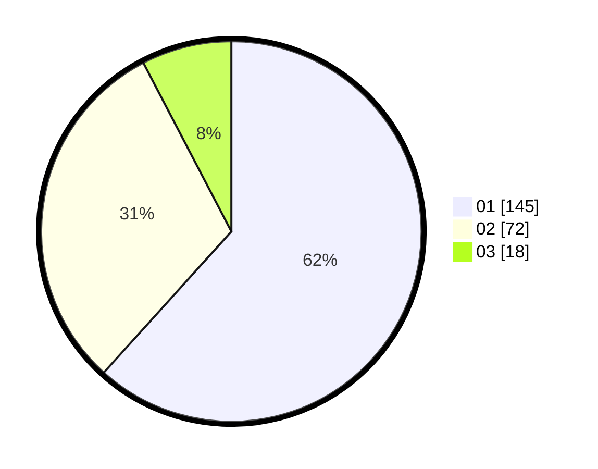

# Hasil

Hasil perolehan suara paslon dapat dilihat pada file paslon-01.txt, paslon-02.txt, dan paslon-03.txt.

Jika tidak ada, artinya data tersebut belum ada pada SIREKAP.

## Perolehan Suara

 * Paslon 01: **145**.
 * Paslon 02: **72**.
 * Paslon 03: **18**.

## Foto C Plano

https://sirekap-obj-formc.kpu.go.id/ebf2/pemilu/ppwp/31/75/09/10/05/3175091005012-20240214-210442--c749bcdf-c862-4744-879c-6889b7c2bd43.jpg

https://sirekap-obj-formc.kpu.go.id/ebf2/pemilu/ppwp/31/75/09/10/05/3175091005012-20240214-210543--d6537488-b99c-4f00-b9d2-8a5a9482d0a9.jpg

https://sirekap-obj-formc.kpu.go.id/ebf2/pemilu/ppwp/31/75/09/10/05/3175091005012-20240214-162220--e7259548-ef85-4c3c-b05e-7da82137e42d.jpg

## DATA PEMILIH TETAP

Jumlah pemilih dalam DPT: **279**.
 * L: **148**.
 * P: **131**.

## DATA PENGGUNA HAK PILIH

Jumlah pengguna hak pilih dalam DPT: **236**.
 * L: **118**.
 * P: **118**.

Jumlah pengguna hak pilih dalam DPTb: **1**.
 * L: **1**.
 * P: **0**.

Jumlah pengguna hak pilih dalam DPK: **1**.
 * L: **0**.
 * P: **1**.

Jumlah pengguna hak pilih: **238**.
 * L: **119**.
 * P: **119**.

## JUMLAH SUARA SAH DAN TIDAK SAH

JUMLAH SELURUH SUARA SAH: **235**.

JUMLAH SUARA TIDAK SAH: **3**.

JUMLAH SELURUH SUARA SAH DAN SUARA TIDAK SAH: **238**.
