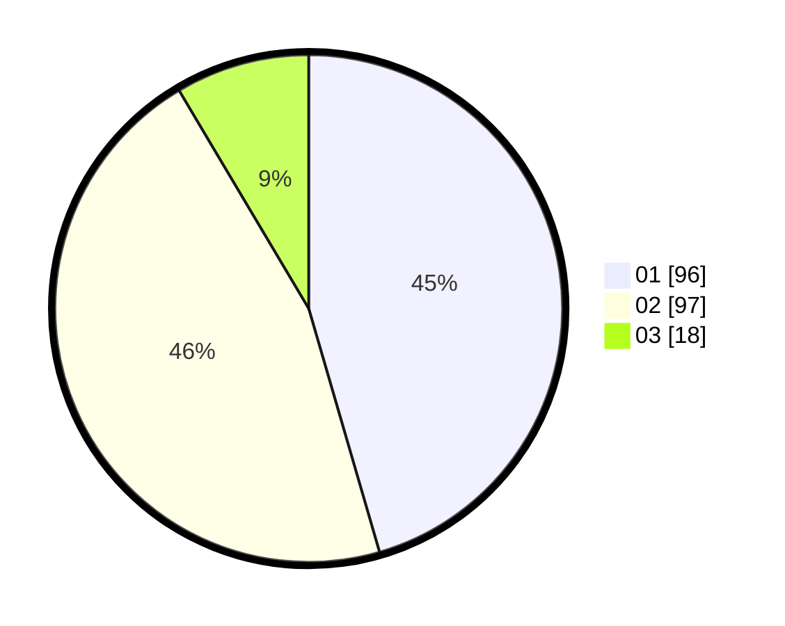

# Hasil

Hasil perolehan suara paslon dapat dilihat pada file paslon-01.txt, paslon-02.txt, dan paslon-03.txt.

Jika tidak ada, artinya data tersebut belum ada pada SIREKAP.

## Perolehan Suara

 * Paslon 01: **96**.
 * Paslon 02: **97**.
 * Paslon 03: **18**.

## Foto C Plano

https://sirekap-obj-formc.kpu.go.id/194d/pemilu/ppwp/31/75/09/10/05/3175091005014-20240214-155550--f5936b05-31e4-4f2c-ab99-b9d0a8217cf8.jpg

https://sirekap-obj-formc.kpu.go.id/194d/pemilu/ppwp/31/75/09/10/05/3175091005014-20240214-155750--265ce574-2b27-49f3-ba79-a4e21b0f04fc.jpg

https://sirekap-obj-formc.kpu.go.id/194d/pemilu/ppwp/31/75/09/10/05/3175091005014-20240214-160104--b2893e1d-ef93-42b7-bf5a-2be339f0678d.jpg
