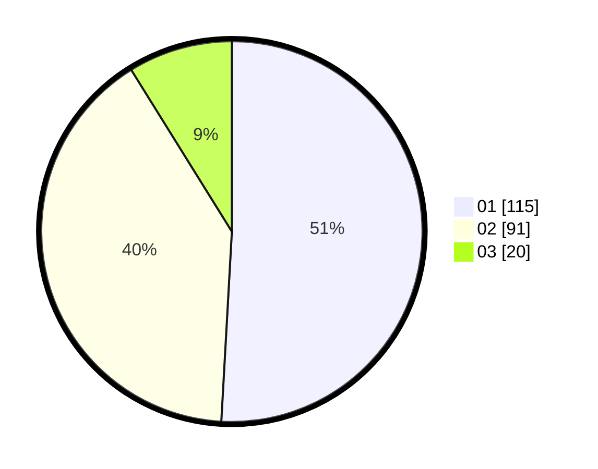

# Hasil

Hasil perolehan suara paslon dapat dilihat pada file paslon-01.txt, paslon-02.txt, dan paslon-03.txt.

Jika tidak ada, artinya data tersebut belum ada pada SIREKAP.

## Perolehan Suara

 * Paslon 01: **115**.
 * Paslon 02: **91**.
 * Paslon 03: **20**.

## Foto C Plano

https://sirekap-obj-formc.kpu.go.id/6138/pemilu/ppwp/31/75/09/10/05/3175091005021-20240214-215551--87df35bc-0f78-48e9-a188-576357174d3c.jpg

https://sirekap-obj-formc.kpu.go.id/6138/pemilu/ppwp/31/75/09/10/05/3175091005021-20240214-220012--2301e816-f20f-4bbc-97b0-544d25f087f7.jpg

https://sirekap-obj-formc.kpu.go.id/6138/pemilu/ppwp/31/75/09/10/05/3175091005021-20240214-220115--fc085d86-03ca-4291-b872-63ba39efb876.jpg

## DATA PEMILIH TETAP

Jumlah pemilih dalam DPT: **286**.
 * L: **144**.
 * P: **142**.

## DATA PENGGUNA HAK PILIH

Jumlah pengguna hak pilih dalam DPT: **225**.
 * L: **108**.
 * P: **117**.

Jumlah pengguna hak pilih dalam DPTb: **2**.
 * L: **0**.
 * P: **2**.

Jumlah pengguna hak pilih dalam DPK: **1**.
 * L: **0**.
 * P: **1**.

Jumlah pengguna hak pilih: **228**.
 * L: **108**.
 * P: **120**.

## JUMLAH SUARA SAH DAN TIDAK SAH

JUMLAH SELURUH SUARA SAH: **226**.

JUMLAH SUARA TIDAK SAH: **2**.

JUMLAH SELURUH SUARA SAH DAN SUARA TIDAK SAH: **228**.
