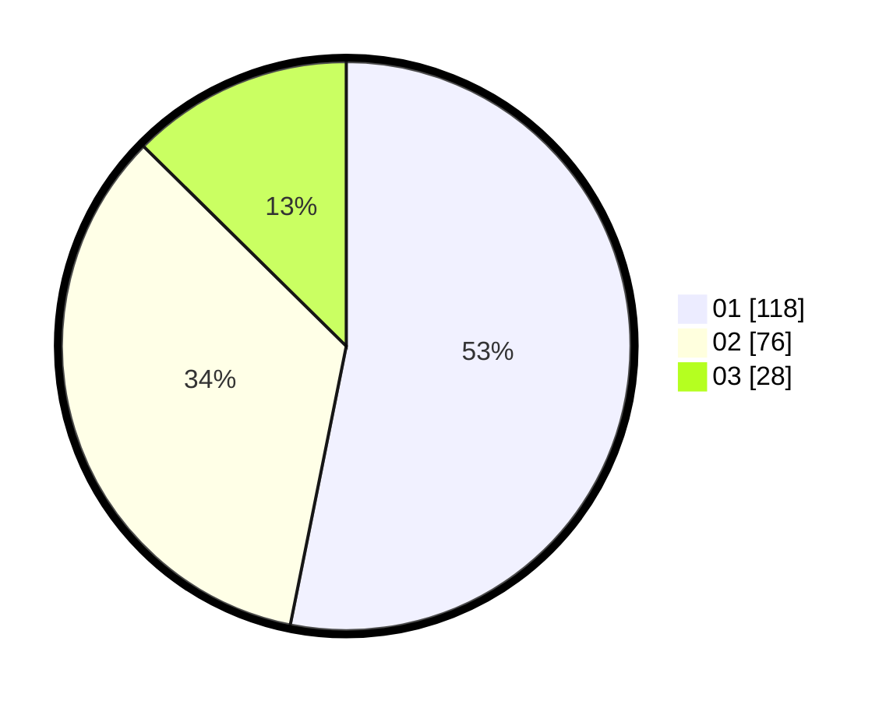

# Hasil

Hasil perolehan suara paslon dapat dilihat pada file paslon-01.txt, paslon-02.txt, dan paslon-03.txt.

Jika tidak ada, artinya data tersebut belum ada pada SIREKAP.

## Perolehan Suara

 * Paslon 01: **118**.
 * Paslon 02: **76**.
 * Paslon 03: **28**.

## Foto C Plano

https://sirekap-obj-formc.kpu.go.id/f25d/pemilu/ppwp/31/75/09/10/05/3175091005025-20240214-190854--4570a6ff-1674-4666-bf01-a406912dd6e7.jpg

https://sirekap-obj-formc.kpu.go.id/f25d/pemilu/ppwp/31/75/09/10/05/3175091005025-20240214-191246--de5d87cf-e323-4646-9692-88fac381500b.jpg

https://sirekap-obj-formc.kpu.go.id/f25d/pemilu/ppwp/31/75/09/10/05/3175091005025-20240214-191127--fdf87bb5-8ff7-447a-b751-6e0e295bcf4c.jpg
