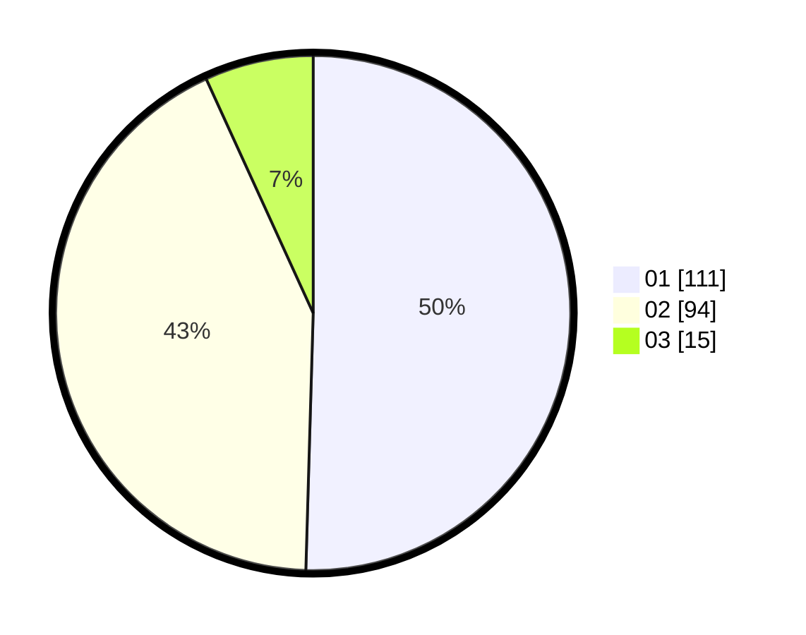

# Hasil

Hasil perolehan suara paslon dapat dilihat pada file paslon-01.txt, paslon-02.txt, dan paslon-03.txt.

Jika tidak ada, artinya data tersebut belum ada pada SIREKAP.

## Perolehan Suara

 * Paslon 01: **111**.
 * Paslon 02: **94**.
 * Paslon 03: **15**.

## Foto C Plano

https://sirekap-obj-formc.kpu.go.id/f0e0/pemilu/ppwp/31/75/09/10/05/3175091005028-20240215-040905--faa5116d-4579-4c76-a18e-6d179eae65da.jpg

https://sirekap-obj-formc.kpu.go.id/f0e0/pemilu/ppwp/31/75/09/10/05/3175091005028-20240215-040648--0a431ffa-c7e4-45b3-81c9-32506ea12e1c.jpg

https://sirekap-obj-formc.kpu.go.id/f0e0/pemilu/ppwp/31/75/09/10/05/3175091005028-20240215-040746--f265ac3a-03e5-408f-9956-cacc8cb71313.jpg
